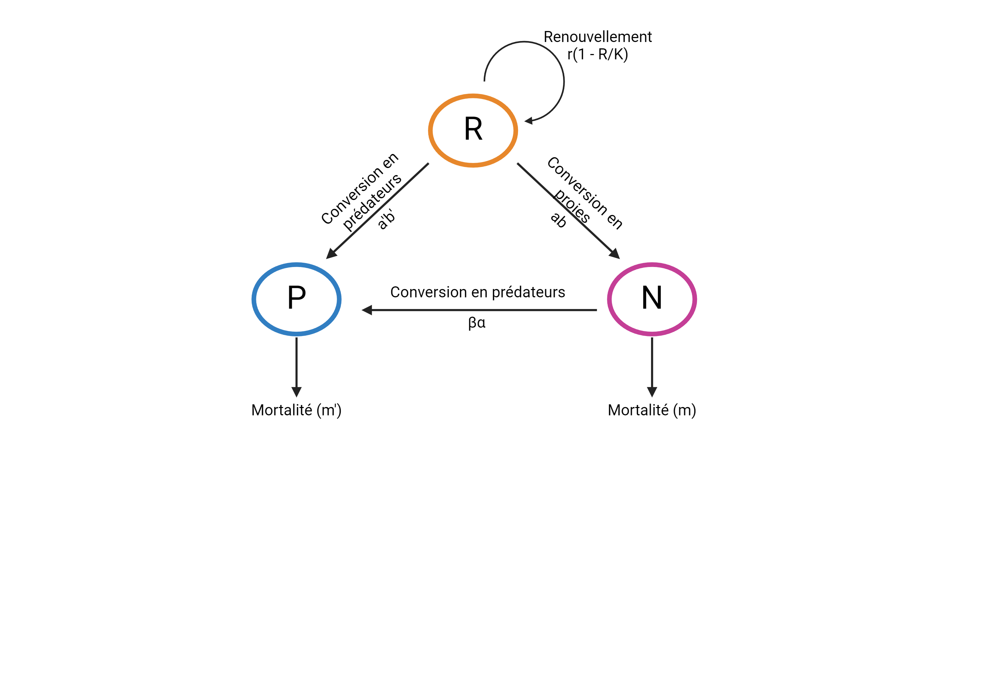
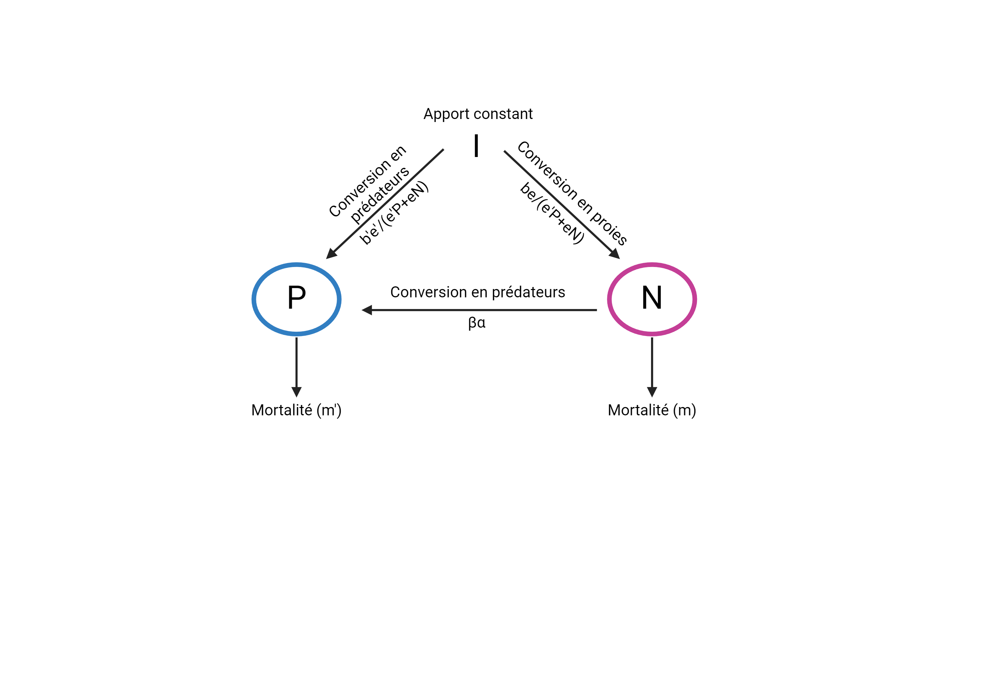
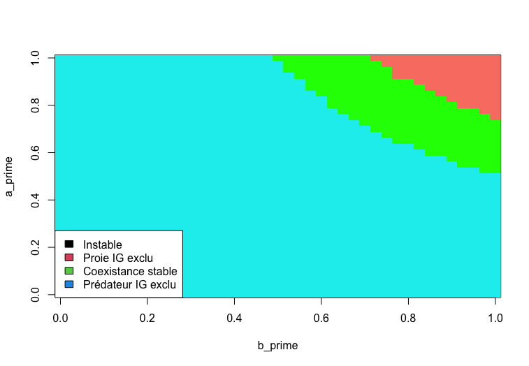
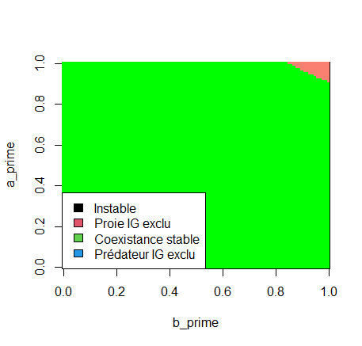

## Question biologique
Quelles sont les conséquences d'incorporer la prédation intraguilde (PIG) dans différents modèles de compétition et de prédation?

***
## Hypothèse
R.D. Holt et G.A. Polis avancent qu'il y a un grand potentiel d'États alternatifs stables avec l'ajout de PIG dans des modèles préexistants tels que le modèle Consommateur-ressource, le modèle proie-prédateur de Lotka-Voltera et le modèle de compétition d'exploitation de Schoener.

***
## Informations pertinentes
La PIG est définit par un système ou un prédateur IG se nourrit de la proie IG ainsi que que de la même ressource que la proie IG, créant des intéractions de compétitions entre le prédateur IG et la proie IG. 

Le modèle basé sur Lotka-Voltera peut être visualisé par le schéma suivant :


Le modèle basé sur Schoener peut être visualisé par le schéma suivant :

Ces deux schémas comportent les mêmes relations qu'il faudra établir dans nos modèles : La conversion de ressources en nouveaux individus, autant pour le prédateur que pour la proie; le renouvellement de la ressource; la conversion de proie en nouveau prédateur; la mortalité des proies et des prédateurs.

***
## Méthodes
Les figures dans l'article n'ont été produites qu'avec les modèles basés sur Lotka-Voltera et Schoener auquels des termes associés au PIG ont été ajoutés. Nous avons donc décidé de seulement modéliser ceux-ci.

Le modèle Lotka-Voltera avec PIG est définit par le système suivant :
$$
\frac{dP}{dt} = P(b'a'R + \beta\alpha N - m');
$$ 
$$
\frac{dN}{dt} = N(abR - \alpha P - m);
$$ 
$$
\frac{dR}{dt} = R(r(1 - \frac{R}{K}) - aN - a'P).
$$ 
Les variables dans ces équations sont définies comme suit :
$P$ : la densité du prédateur IG;
$N$ : la densité de la la proie IG;
$R$ : la densité de la ressource commune;
$a$ : la réponse fonctionnelle de la proie IG vers la ressource commune;
$a'$ : la réponse fonctionnelle du prédateur IG vers la ressource commune;
$\alpha$ : la réponse fonctionnelle du prédateur IG vers la proie IG (et donc le taux de mortalité de la proie IG causée par le prédateur IG);
$b$ : le taux de conversion de la consommation de la ressource vers la reproduction de la proie IG;
$b'$ : le taux de conversion de la consommation de la ressource vers la reproduction du prédateur IG;
$\beta$ : le taux de conversion de la consommation de la proie IG vers la reproduction du prédateur IG;
$K$ : la quantité de ressource commune lorsqu'elle est stable;
$m$ : le taux de mortalité densité-dépendant de la proie IG;
$m'$ : le taux de mortalité densité-dépendant du prédateur IG;
$r$ : le taux de croissance de la ressource commune.

L'équation de $\frac{dP}{dt}$ a trois termes multipliés par $P$. Le premier représente les gains en population (reproduction) des prédateurs IG en fonction de la densité de la ressource commune. Le deuxième illustre les gains en population du prédateurs IG grâce à la consommation de la proie IG en fonction de la densité de la proie IG. Le dernier terme est simplement le taux de mortalité du prédateurs IG.

L'équation de $\frac{dN}{dt}$ signifie la même chose, mais pour la proie IG, sauf en ce qui a trait au deuxième terme. En effet, celui-ci représente le mortalité due au prédateurs IG en fonction de la densité de prédateurs IG.

L'équation de $\frac{dR}{dt}$ a trois termes multipliés par $R$. Le premier est la croissance logistique de la ressource commune dans le système. Les deuxième et troisième termes représentent la consommation de la ressource commune par respectivement la proie IG et le prédateurs IG en fonction de leur densité.


Le modèle de Schoener avec PIG est définit par le système suivant :
$$
\frac{dP}{dt} = P(\frac{b'e'I}{e'P + eN} + \beta\alpha N - m');
$$ 
$$
\frac{dN}{dt} = N(\frac{beI}{e'P + eN} - \alpha P - m).
$$ 

Les nouvelles variables dans ces équations sont définies comme suit (les définitions précédentes sont toujours valables) :
$e$ : l'habileté relative de la proie IG à compétitionner pour la ressource commune;
$e'$ : l'habileté relative du prédateur IG à compétitionner pour la ressource commune;
$I$ : le taux d'entrée de la ressource commune dans le système.

L'équation de $\frac{dP}{dt}$ a trois termes multipliés par $P$. Le premier représente la quantité de ressource commune que le prédateur IG est capable d'aller chercher sur la quantité totale et constante de ressource commune entrante en compétitionnant avec la proie IG. Le deuxième illustre les gains en population du prédateurs IG grâce à la consommation de la proie IG en fonction de la densité de la proie IG. Le dernier terme est simplement le taux de mortalité du prédateurs IG.

L'équation de $\frac{dN}{dt}$ signifie la même chose, mais pour la proie IG, sauf en ce qui a trait au deuxième terme. En effet, celui-ci représente le mortalité due au prédateurs IG en fonction de la densité de prédateurs IG.

***
## Suppositions
1. Le prédateur IG est un oligophage dépendant de deux sources d'alimentation : la proie IG et la ressource commune. La proie IG est seulement dépendante de la ressource commune.

2. Dans le modèle basé sur Lotka-Voltera, la ressource commune croit en suivant une courbe logistique. Dans le modèle basé sur Schoener, la ressource commune croit à taux constant.

3. La portion du taux de croissance du prédateur IG permis par la consommation de la proie IG est plus grande que 0. 

4. Le prédateur IG bénéficie des effets positifs de la consommation de la proie IG de façon instannée. 

5. La proie IG est meilleure que le prédateur IG dans l'exploitation de la ressource commune.

6. Dans le modèle basé sur Lotka-Voltera, les réponses fonctionnelles sont des intéractions linéaires et les taux de croissance des populations sont proportionnels aux taux de consommation. Ces variables ne sont pas linéaires dans le modèle basé sur Schoener.

***
## Calculs

Voici la procédure pour initialiser le modèle Lotka-Volterra avec prédation intraguilde:
```{r, eval=FALSE}
#Fonction
LV5 <- function(t, ConI, parms5 = c(a,a_prime,alpha,b,b_prime,beta,K,m,m_prime,r)){
  
  with(as.list(ConI, parms5), {
    # Lotka-voltera
    dP <- P*(b_prime*a_prime*R + beta*alpha*N - m_prime) # dP/dt
    dN <- N*(a*b*R - m - alpha*P) #dN/dt
    dR <- R*(r*(1- (R/K)) - a*N - a_prime*P) #dR/dt
    
    # Résultat
    res <- c(dP = dP, dN = dN, dR = dR)
    return(list(res))
  })
}
```


Voici la procédure pour modéliser l'équation différentielle de Lotka-Volterra avec prédation intraguilde (Figure 1A). Les variables $b'$ et $a'$ prennent le rôle de variables dépendante et indépendante respectivement. Elle varient de 0 à 1. Les autres variables sont fixées aux valeurs suivantes. $\alpha$ = 0.5, $b$ = 1, $\beta$ = 1, $K$ = 1, $m$ = 0.5, $m'$ = 0.5 et finalement, $r$ = 1.
```{r, eval=FALSE}
library(deSolve)

#Conditions initiales
P0 <- 0.3333 #prédateur IG
N0 <- 0.3333 #proie IG
R0 <- 1 - P0 - N0 #Ressource
CI_LV5 <- c(P=P0, N=N0, R=R0)


#Boucle d'équilibre
figure_1A <- matrix(0.5, 101, 101) #création de la matrice pour faire une image
lim <- 0.01 #Puisque le résultat de l'équation différentiel peut s'approcher de 0 sans ne jamais l'atteindre, les conditions P, N et R = 0 peuvent ne jamais être atteinte.
            # La mise en place d'une limite où on assume que la densité P, N ou R est égal à 0 permet de mieux modéliser les différents étapes d'équilibre.
steps <- 100 #temps auquel l'équilibre aura surement été atteint

for(i in 0:100){
  for(j in 0:100){
    
    parametre_LV5 <- c(a <- 1, #paramètres a' et b' varient entre 0 et 1
               a_prime <- i/100,
               alpha     <- 0.5,
               b         <- 1,
               b_prime <- j/100,
               beta      <- 1,
               K         <- 1,
               m         <- 0.5,
               m_prime   <- 0.5,
               r         <- 1)

    #Solution du système d'équation
    LV5_sol <- ode(y=CI_LV5, times= seq(1,steps), func= LV5, parms= parametre_LV5)
    
    #Classement des équilibres
    if(LV5_sol[steps,'P'] < lim & LV5_sol[steps,'N'] > lim){ #Prédateur IG exclus
      figure_1A[i+1,j+1] <- 0.5 #pour être entre 0 et 1 et faire partie de la 1re catégorie de la fonction image
      
    }else if(LV5_sol[steps,'P'] > lim & LV5_sol[steps,'N'] < lim){ #Proie IG exclus
      figure_1A[i+1,j+1] <- 1.5
      
    }else if(LV5_sol[steps,'P']  > lim & LV5_sol[steps,'N']  > lim){ #Coexistance stable
      figure_1A[i+1,j+1] <- 2.5
      
    }else{  #Instable
      figure_1A[i+1,j+1] <- 3.5
      
    }

  } #Fin boucle j
} #Fin boucle i


#Visualisation
image (figure_1A, col = c("cyan2", "salmon", "green", "brown4"), breaks = 0:4, xlab = 'b_prime' , ylab = 'a_prime')
legend(x = 'bottomleft', legend = c('Instable', 'Proie IG exclu','Coexistance stable', 'Prédateur IG exclu'), fill = 1:4)

```

Voici la procédure pour modéliser l'équation différentielle de Lotka-Volterra avec prédation intraguilde  (Figure 1B). On reprend ce qui a été fait pour la figure 1A, mais on change certain paramètres. Les variables $b'$ et $a'$ reprennent le rôle de variables dépendante et indépendante respectivement. Les autres variables sont fixées aux même valeurs que précédemment, à l'exception de  $\alpha$, qui passe de 0.5 à 1, et $m$, qui passe de 0.5 à 0.1. Ceci représente un cas où la mortalité densité-spécifique de la proie diminue, et que la réponse fonctionnelle du prédateur à la proie augmente.

```{r, eval=FALSE}
library(deSolve)

#Boucle d'équilibre
figure_1B <- matrix(0.5, 101, 101) #création de la matrice pour faire une image
lim <- 0.01 #Puisque le résultat de l'équation différentiel peut s'approcher de 0 sans ne jamais l'atteindre, les conditions P, N et R = 0 peuvent ne jamais être atteinte.
            # La mise en place d'une limite où on assume que la densité P, N ou R est égal à 0 permet de mieux modéliser les différents étapes d'équilibre.
steps <- 100 #temps auquel l'équilibre aura surement été atteint

for(i in 0:100){
  for(j in 0:100){
    
    parametre_LV5 <- c(a <- 1, #paramètres (a' et b' variables entre 0 et 1)
               a_prime <- i/100,
               alpha     <- 1, #passage de 0.5 à 1 pour la figure 1 B. La réponse fonctionnelle du prédateur intraguilde à la proie augmente
               b         <- 1,
               b_prime <- j/100,
               beta      <- 1,
               K         <- 1,
               m         <- 0.1, #passage de 0.5 à 0.1 pour la figure 1 B. La mortalité dénsité/indépendante de la proie diminue
               m_prime   <- 0.5,
               r         <- 1)

    #Solution du système d'équation
    LV5_sol <- ode(y=CI_LV5, times= seq(1,steps), func= LV5, parms= parametre_LV5)
    
    #Classement des équilibres
    if(LV5_sol[steps,'P'] < lim & LV5_sol[steps,'N'] > lim){ #Prédateur IG exclus
      figure_1B[i+1,j+1] <- 0.5 #pour être entre 0 et 1 et faire partie de la 1re catégorie de la fonction image
      
    }else if(LV5_sol[steps,'P'] > lim & LV5_sol[steps,'N'] < lim){ #Proie IG exclus
      figure_1B[i+1,j+1] <- 1.5
      
    }else if(LV5_sol[steps,'P']  > lim & LV5_sol[steps,'N']  > lim){ #Coexistance stable
      figure_1B[i+1,j+1] <- 2.5
      
    }else{  #Instable
      figure_1B[i+1,j+1] <- 3.5
      
    }

  } #Fin boucle j
} #Fin boucle i


#Visualisation
image (figure_1B, col = c("cyan2", "salmon", "green", "brown4"), breaks = 0:4, xlab = 'b_prime' , ylab = 'a_prime')
legend(x = 'bottomleft', legend = c('Instable', 'Proie IG exclu','Coexistance stable', 'Prédateur IG exclu'), fill = 1:4)

```

***
Les calculs avec le modèle basé sur Schoener n'ont pas été frutueux. Nous avons donc décidé de ne pas les afficher et de s'en tenir qu'à un seul modèle pour la suite. 
***

## Résultats
Pour le premier modèle (basé sur Lotka-Voltera), les figures d'équilibres obtenue selon le choix des paramètres sont les suivantes : 



Dans la figure 1A, les variables $a'$ et $b'$ prennent le rôle de variables dépendante et indépendante respectivement et varient de 0 et 1, alors que les autres variables sont fixés aux valeurs suivantes : 

$a = 1$

$\alpha = 0.5$

$b = 1$

$\beta = 1$

$K = 1$

$m = 0.5$

$m' = 0.5$

$r = 1$



Dans la figure 1B, les variables $a'$ et $b'$ reprennent le rôle de variables dépendante et indépendante respectivement, alors que les autres variables sont fixés aux mêmes valeurs qu'à la figure 1A, à deux exceptions  : 

$\alpha$ = 1. Ceci représente un cas où la réponse fonctionnelle du prédateur à la proie a augmenté.

$m$ = 0.1. Ceci représente un cas où la mortalité densité-spécifique de la proie a diminué.

***
## Interprétations biologiques
L'hypothèse de départ était qu'il y avait une création de plusieurs états alternatifs stables lorsqu'on ajoutait de la prédation IG dans des modèles préexistants. Le modèle proie-prédateur de Lotka-Voltera bonifié de PIG a été utilisé pour tester cette hypothèse. 

D'abord, la figure 1A permet d'observer qu'il existe 3 états d'équilibres : une absence totale de proie IG, une absence totale de prédateur IG et une coexistance. Lorsque la réponse fonctionnelle du prédateur IG vers la ressource commune et le taux de conversion de la ressource sont bas (Somme en bas de 1.6), le prédateur IG est toujours exclu. On pourrait en comprendre que le prédateur IG n'arrive pas assez à subvenir à ces besoins avec si peu de gains dans ces conditions. Lorsque les deux taux étaient très élevés (Somme au dessus de 1.8), c'est plutôt la proie IG qui était toujours exclue. On peut en déduire que le prédateur IG est trop compétitifs pour la ressource commune en ces conditions pour permettre à la proie IG de survivre. Finalement, une coexistance stable semble se produire lorsque la somme des deux mêmes taux se trouvent entre 1.5 et 1.8. On peut alors interpréter qu'il y a un équilibre fragile dans la compétition pour la ressource commune entre la proie IG et le prédateur IG et que c'est seulement en ces conditions qu'ils coexistent sans modifier leur taille de population. 

Ensuite, la figure 1B représente une situation légèrement différente de la figure 1A avec un taux de mortalité densité-dépendant de la proie IG diminué et une réponse fonctionnelle du prédateur IG à la proie augmentée. Il est alors possible d'observer seulement 2 états : la coexistance stable et l'exclusion de la proie IG. L'état d'exclusion du prédateur IG semble avoir disparu par rapport à la figure 1A. Cela pourrait s'expliquer par la réponse fonctionnel du prédateur IG à la proie qui a augmentée. En effet, il se pourrait qu'il est assez augmenté pour que cela soit impossible que la population de prédateur IG s'éteignent. L'exclusion de la proie IG est encore présente, mais en moins grande proportion dans la figure 1B que dans la figure 1A (somme des deux axes au dessus de 1.9 environ). Cela est logique, car la mortalité de la proie IG a été diminué; la proie IG devrait mieux survivre et sa population moins s'éteindre. La coexistance occupe la majorité des cas possible pour les valeurs de réponse fonctionnelle du prédateur IG vers la ressource commune et de taux de conversion de la ressource. Cela est probablement due à l'effet combiné d'une plus grande consommation de la proie IG par le prédateur IG, mais une meilleure survie globale de la proie IG.

***
***
***