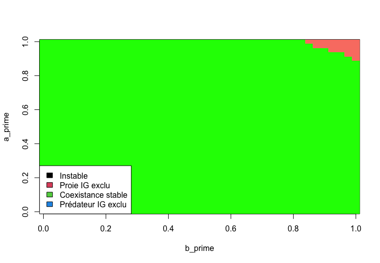
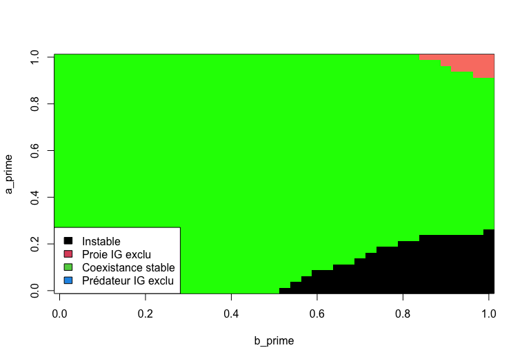

## Question biologique
Quelles sont les conséquences d'incorporer la prédation intraguilde (PIG) dans différents modèles de compétition et de prédation?

***
## Hypothèse
R.D. Holt et G.A. Polis (1997) avancent qu'il y a un grand potentiel d'états alternatifs stables avec l'ajout de PIG dans des modèles préexistants tels que le modèle consommateur-ressource, le modèle proie-prédateur de Lotka-Voltera et le modèle de compétition d'exploitation de Schoener.

***
## Informations pertinentes
La PIG est définie par un système ou un prédateur IG se nourrit de la proie IG ainsi que que de la même ressource que la proie IG, créant des interactions de compétitions entre le prédateur IG et la proie IG. 

Le modèle basé sur Lotka-Voltera peut être visualisé par le schéma suivant :


Le modèle basé sur Schoener peut être visualisé par le schéma suivant :

Ces deux schémas comportent les mêmes relations qu'il faudra établir dans nos modèles : la conversion de ressources en nouveaux individus, autant pour le prédateur que pour la proie; le renouvellement de la ressource; la conversion de proie en nouveau prédateur; la mortalité des proies et des prédateurs.

***
## Méthodes
Les figures dans l'article n'ont été produites qu'avec les modèles basés sur Lotka-Voltera et Schoener auxquels des termes associés au PIG ont été ajoutés. Nous avons donc décidé de seulement modéliser ceux-ci.

Le modèle Lotka-Voltera avec PIG est défini par le système suivant :
$$
\frac{dP}{dt} = P(b'a'R + \beta\alpha N - m');
$$ 
$$
\frac{dN}{dt} = N(abR - \alpha P - m);
$$ 
$$
\frac{dR}{dt} = R(r(1 - \frac{R}{K}) - aN - a'P).
$$ 
Les variables dans ces équations sont définies comme suit :
$P$ : la densité du prédateur IG;
$N$ : la densité de la proie IG;
$R$ : la densité de la ressource commune;
$a$ : la réponse fonctionnelle de la proie IG vers la ressource commune;
$a'$ : la réponse fonctionnelle du prédateur IG vers la ressource commune;
$\alpha$ : la réponse fonctionnelle du prédateur IG vers la proie IG (et donc le taux de mortalité de la proie IG causée par le prédateur IG);
$b$ : le taux de conversion de la consommation de la ressource vers la reproduction de la proie IG;
$b'$ : le taux de conversion de la consommation de la ressource vers la reproduction du prédateur IG;
$\beta$ : le taux de conversion de la consommation de la proie IG vers la reproduction du prédateur IG;
$K$ : la quantité de ressource commune lorsqu'elle est stable;
$m$ : le taux de mortalité densité-dépendant de la proie IG;
$m'$ : le taux de mortalité densité-dépendant du prédateur IG;
$r$ : le taux de croissance de la ressource commune.

L'équation de $\frac{dP}{dt}$ a trois termes multipliés par $P$. Le premier représente les gains en population (reproduction) des prédateurs IG en fonction de la densité de la ressource commune. Le deuxième illustre les gains en population du prédateur IG grâce à la consommation de la proie IG en fonction de la densité de la proie IG. Le dernier terme est simplement le taux de mortalité du prédateur IG.

L'équation de $\frac{dN}{dt}$ signifie la même chose, mais pour la proie IG, sauf en ce qui a trait au deuxième terme. En effet, celui-ci représente le taux de mortalité due aux prédateurs IG en fonction de la densité de prédateurs IG.

L'équation de $\frac{dR}{dt}$ a trois termes multipliés par $R$. Le premier est la croissance logistique de la ressource commune dans le système. Les deuxième et troisième termes représentent la consommation de la ressource commune par respectivement la proie IG et le prédateur IG en fonction de leur densité.


Le modèle de Schoener avec PIG est définie par le système suivant :
$$
\frac{dP}{dt} = P(\frac{b'e'I}{e'P + eN} + \beta\alpha N - m');
$$ 
$$
\frac{dN}{dt} = N(\frac{beI}{e'P + eN} - \alpha P - m).
$$ 

Les nouvelles variables dans ces équations sont définies comme suit (les définitions précédentes sont toujours valables) :
$e$ : l'habileté relative de la proie IG à compétitionner pour la ressource commune;
$e'$ : l'habileté relative du prédateur IG à compétitionner pour la ressource commune;
$I$ : le taux d'entrée de la ressource commune dans le système.

L'équation de $\frac{dP}{dt}$ a trois termes multipliés par $P$. Le premier représente la quantité de ressource commune que le prédateur IG est capable d'aller chercher sur la quantité totale et constante de ressource commune entrante en compétitionnant avec la proie IG. Le deuxième illustre les gains en population du prédateur IG grâce à la consommation de la proie IG en fonction de la densité de la proie IG. Le dernier terme est simplement le taux de mortalité du prédateur IG.

L'équation de $\frac{dN}{dt}$ signifie la même chose, mais pour la proie IG, sauf en ce qui a trait au deuxième terme. En effet, celui-ci représente le taux de mortalité due aux prédateurs IG en fonction de la densité de prédateurs IG.

***
## Suppositions
1. Le prédateur IG est un oligophage dépendant de deux sources d'alimentation : la proie IG et la ressource commune. La proie IG est seulement dépendante de la ressource commune.

2. Dans le modèle basé sur Lotka-Voltera, la ressource commune croit en suivant une courbe logistique. Dans le modèle basé sur Schoener, la ressource commune croît à taux constant.

3. La portion du taux de croissance du prédateur IG permis par la consommation de la proie IG est plus grande que 0. 

4. Le prédateur IG bénéficie des effets positifs de la consommation de la proie IG de façon instantanée. 

5. La proie IG est meilleure que le prédateur IG dans l'exploitation de la ressource commune.

6. Dans le modèle basé sur Lotka-Voltera, les réponses fonctionnelles sont des interactions linéaires et les taux de croissance des populations sont proportionnels aux taux de consommation. Ces variables ne sont pas linéaires dans le modèle basé sur Schoener.

***
## Calculs

Voici la procédure pour initialiser le modèle Lotka-Volterra avec prédation intraguilde:
```{r, eval=FALSE}
#Fonction
LV5 <- function(t, ConI, parms5 = c(a,a_prime,alpha,b,b_prime,beta,K,m,m_prime,r)){
  
  with(as.list(ConI, parms5), {
    # Lotka-voltera
    dP <- P*(b_prime*a_prime*R + beta*alpha*N - m_prime) # dP/dt
    dN <- N*(a*b*R - m - alpha*P) #dN/dt
    dR <- R*(r*(1- (R/K)) - a*N - a_prime*P) #dR/dt
    
    # Résultat
    res <- c(dP = dP, dN = dN, dR = dR)
    return(list(res))
  })
}
```


Voici la procédure pour modéliser l'équation différentielle de Lotka-Volterra avec prédation intraguilde. Les variables $b'$ et $a'$ prennent le rôle de variables dépendantes et indépendantes respectivement. Elle varient de 0 à 1. Les autres variables sont fixées aux valeurs suivantes. $\alpha$ = 0.5, $b$ = 1, $\beta$ = 1, $K$ = 1, $m$ = 0.5, $m'$ = 0.5 et finalement, $r$ = 1. L'exemple ci-dessous représente le calcul qui a générer la figure 1A de l'article de Holt et Polis (Figure 1A).

```{r, eval=FALSE}
library(deSolve)

#Conditions initiales
P0 <- 0.3333 #prédateur IG
N0 <- 0.3333 #proie IG
R0 <- 1 - P0 - N0 #Ressource
CI_LV5 <- c(P=P0, N=N0, R=R0)


#Boucle d'équilibre
grain <- 40 #Résolution de l'image. Un compromis a été fait en la précision et la vitesse d'éxécution du code: un grain plus élevé aurait été souhaitable, mais nous ne croyons pas que cela ai changé drastiquement les résultats.
figure_1A <- matrix(0.5, grain + 1, grain + 1) #création de la matrice pour faire une image. Le choix d'une matrice de dimensions légèrement plus grande est pour qu'elle puisse contenir les valeurs de 0 à la taille maximale du grain, soit grain +1

lim <- 0.01 #Puisque le résultat de l'équation différentiel peut s'approcher de 0 sans ne jamais l'atteindre, les conditions P, N et R = 0 peuvent ne jamais être atteinte.
            # La mise en place d'une limite où on assume que la densité P, N ou R est égal à 0 permet de mieux modéliser les différents étapes d'équilibre.

limsd <- 0.0001 #Pour vérifier si la fonction est à l'équilibre ou non, nous comparons l'écart type des derniers 10% des termes à un écart-type que nous jugeons représentatif d'un système à l'équilibre, ou en voie de le devenir (Fig X). 
steps <- 300 #temps auquel l'équilibre aura surement été atteint. A été trouvé, de concert avec le terme "limsd", à tâton.


maxsd<- 0 # Paramètre d'une fonction qui trouve la plus grande instabilité. Elle enregistre le plus grand écart-type des 10 derniers pourcent.
maxi <- 0 # Paramètre qui enregistre la valeur de a' où est généré la plus grande instabilité
maxj <- 0 ## Paramètre qui enregistre la valeur de b' où est généré la plus grande instabilité

for(i in 0:grain){
  for(j in 0:grain){
    
    parametre_LV5 <- c(a <- 1, #paramètres a' et b' varient entre 0 et 1
               a_prime <- i/grain,
               alpha     <- 0.5,
               b         <- 1,
               b_prime <- j/grain,
               beta      <- 1,
               K         <- 1,
               m         <- 0.5,
               m_prime   <- 0.5,
               r         <- 1)

    #Solution du système d'équation
    LV5_sol <- ode(y=CI_LV5, times= seq(1,steps), func= LV5, parms= parametre_LV5)
    
    #Classement des équilibres
   
    
    if(sd(LV5_sol[(0.9*steps):steps,'P']) > limsd | sd(LV5_sol[(0.9*steps):steps,'N']) > limsd){ #Instable
      figure_1A[i+1,j+1] <- 3.5 
      
      # Fonction qui trouve l'endroit avec le plus d'instabilité
      if(sd(LV5_sol[(0.9*steps):steps,'P']) > maxsd){
        maxsd <- sd(SuperPred_sol[(0.9*steps):steps,'P'])
        maxi <- i
        maxj <- j
        
        if(sd(LV5_sol[(0.9*steps):steps,'N']) > maxsd){
          maxsd <- sd(SuperPred_sol[(0.9*steps):steps,'N'])
          maxi <- i
          maxj <- j
    
      print(paste("i = ", i, "with a sd of:",(sd(LV5_sol[(0.9*steps):steps,'P'])),"j = ", j, "with a sd of:",(sd(LV5_sol[(0.9*steps):steps,'N']))))
      #Code pour trouver les positions des endroits avec de l'instabilité, et en intepréter graphiquement le résultat
    
    
    }else if(LV5_sol[steps,'P'] < lim & LV5_sol[steps,'N'] > lim){ #Prédateur IG exclus
      figure_1A[i+1,j+1] <- 0.5 #pour être entre 0 et 1 et faire partie de la 1re catégorie de la fonction image
      
    }else if(LV5_sol[steps,'P'] > lim & LV5_sol[steps,'N'] < lim){ #Proie IG exclus
      figure_1A[i+1,j+1] <- 1.5
      
    }else if(LV5_sol[steps,'P']  > lim & LV5_sol[steps,'N']  > lim){ #Coexistence stable
      figure_1A[i+1,j+1] <- 2.5
    }

  } #Fin boucle j
} #Fin boucle i


#Visualisation
image (figure_1A, col = c("cyan2", "salmon", "green", "black"), breaks = 0:4, xlab = 'b_prime' , ylab = 'a_prime')
legend(x = 'bottomleft', legend = c('Instable', 'Proie IG exclu','Coexistence stable', 'Prédateur IG exclu'), fill = 1:4)

```

Pour modéliser l'équation différentielle de Lotka-Volterra avec prédation intraguilde  (Figure 1B), nous avons repris la même démarche, tout en changeant certains paramètres. Les variables $b'$ et $a'$ reprennent le rôle de variables dépendante et indépendante respectivement. Les autres variables sont fixées aux mêmes valeurs que précédemment, à l'exception de  $\alpha$, qui passe de 0.5 à 1, et $m$, qui passe de 0.5 à 0.1. Ceci représente un cas où la mortalité densité-spécifique de la proie diminue, et que la réponse fonctionnelle du prédateur à la proie augmente.

Lors de notre expérimentation, nous avons remarqué que le résultat de la simulation du modèle changeait en fonction du nombre de pas de temps choisis. Ceci nous a poussé à tenter de voir graphiquement le comportement des populations en état d'instabilité pour en comprendre la cause. Voici la procédure pour comprendre l'état d'instabilité supposément présente à la figure 2.

```{r, eval=FALSE}

##Affichage des coordonnées de la plus grande instabilité
print(paste(maxsd,"at", maxi, "and", maxj))


##Modélisation de la plus grande instabilité avec les paramètres de la figure d'état d'équilibre
parametre_LV5 <- c(a   <- 1,
                   a_prime   <- maxi/grain,
                   alpha     <- 1,
                   b         <- 1,
                   b_prime   <- maxj/grain,
                   beta      <- 1,
                   K         <- 1,
                   m         <- 0.1,
                   m_prime   <- 0.5,
                   r         <- 1,)

SuperPred_sol <- ode(y=CI_LV5, times= seq(1,steps), func= LV5, parms= parametre_LV5)


ggplot() +
  geom_line(aes(LV5_sol[,'time'], LV5_sol[,'P']), color = 'red') +
  geom_line(aes(LV5_sol[,'time'], LV5_sol[,'N']), color = 'blue') +
  geom_line(aes(LV5_sol[,'time'], LV5_sol[,'R']), color = 'green') +
  labs(title = "Modèle Lotka-Volterra bonifié avec prédation intraguilde", x = "Temps écoulé (pas de temps)", y = "Nombre d'individus") +
  theme_minimal()

```

***
Nous n'avons pas été en mesure de reproduire les figures générer par le modèle de Shoener avec PIG. En effet, les paramètres ainsi que les pas de temps ne sont pas définies, ce qui rends impossible de bien paramétrer le modèle. Nous avons donc décidé de ne pas les afficher et de s'en tenir qu'à un seul modèle pour la suite. 
***

## Résultats
Pour le premier modèle (basé sur Lotka-Voltera), les figures d'équilibres obtenues selon le choix des paramètres sont les suivantes : 


Dans la figure 1A, les variables $a'$ et $b'$ prennent le rôle de variables dépendantes et indépendantes respectivement et varient de 0 et 1, alors que les autres variables sont fixées aux valeurs suivantes : 

$a = 1$

$\alpha = 0.5$

$b = 1$

$\beta = 1$

$K = 1$

$m = 0.5$

$m' = 0.5$

$r = 1$



Dans la figure 1B, les variables $a'$ et $b'$ reprennent le rôle de variables dépendantes et indépendantes respectivement, alors que les autres variables sont fixés aux mêmes valeurs qu'à la figure 1A, à deux exceptions  : 

$\alpha$ = 1. Ceci représente un cas où la réponse fonctionnelle du prédateur à la proie a augmenté.

$m$ = 0.1. Ceci représente un cas où la mortalité densité-spécifique de la proie a diminué.

***
## Interprétations biologiques
L'hypothèse de départ était qu'il y avait plusieurs états alternatifs stables lorsqu'on ajoutait de la prédation IG dans des modèles préexistants. Le modèle proie-prédateur de Lotka-Voltera bonifié de PIG a été utilisé pour tester cette hypothèse. 

D'abord, la figure 1A permet d'observer qu'il existe 3 états d'équilibres : une absence totale de proie IG, une absence totale de prédateur IG et une coexistence. Lorsque la réponse fonctionnelle du prédateur IG vers la ressource commune et le taux de conversion de la ressource sont bas (somme en bas de 1.6), le prédateur IG est toujours exclu. On pourrait en comprendre que le prédateur IG n'arrive pas assez à subvenir à ces besoins avec si peu de gains dans ces conditions. Lorsque les deux taux étaient très élevés (somme au dessus de 1.8), c'est plutôt la proie IG qui était toujours exclue. On peut en déduire que le prédateur IG est trop compétitif pour la ressource commune en ces conditions pour permettre à la proie IG de survivre. Finalement, une coexistence stable semble se produire lorsque la somme des deux mêmes taux se trouve entre 1.5 et 1.8. On peut alors interpréter qu'il y a un équilibre fragile dans la compétition pour la ressource commune entre la proie IG et le prédateur IG et que c'est seulement en ces conditions qu'ils coexistent sans modifier leur taille de population. 

Ensuite, la figure 1B représente une situation assez différente de la figure 1A avec un taux de mortalité densité-dépendant de la proie IG diminué et une réponse fonctionnelle du prédateur IG à la proie augmentée. Il est alors possible d'observer seulement 2 états : la coexistence stable et l'exclusion de la proie IG. L'état d'exclusion du prédateur IG semble avoir disparu par rapport à la figure 1A. Cela pourrait s'expliquer par la réponse fonctionnelle du prédateur IG à la proie qui a augmenté. En effet, il se pourrait qu'il ait assez augmenté pour que cela soit impossible que la population de prédateur IG s'éteigne. L'exclusion de la proie IG est encore présente, mais en moins grande proportion dans la figure 1B que dans la figure 1A (somme des deux axes au-dessus de 1.9 environ). Cela est logique, car la mortalité de la proie IG a été diminuée; la proie IG devrait mieux survivre et sa population moins s'éteindre. La coexistence occupe la majorité des cas possibles pour les valeurs de réponse fonctionnelle du prédateur IG vers la ressource commune et de taux de conversion de la ressource. Cela est probablement dû à l'effet combiné d'une plus grande consommation de la proie IG par le prédateur IG, mais une meilleure survie globale de la proie IG.

Finalement, il est à noter que toutes les figures ont été produites à 300 pas de temps pour avoir la certitude que l'équilibre était atteint. Or, des instabilités à des endroits approximativement similaire à ce qui est observé dans l'article de R.D. Holt et G.A. Polis (1997) étaient visibles à 100 pas de temps (les valeurs n'ont pas encore convergé vers l'équilibre), et ce dans la figure 1A et la figure 1B (Figure 2). 


Lorsque l'on observe l'état d'instabilité supposé à 100 pas de temps, on remarque qu'il s'agit en fait d'une atténuation des cycles qui, après assez de temps, disparait et atteint l'équilibre (Figure 3 et 4).


Cela est mis en évidence lorsqu'on compare avec la dynamique des populations après 300 pas de temps.


Cela pourrait expliquer en partie pourquoi nous obtenons des résultats différents de l'article. Nous concluons donc que l'article est difficilement reproductible puisqu'il ne définit pas bien comment reproduire l'état de stabilité et que cet état peut être trouvé à différent pas de temps sous différentes formes.

L'hypothèse de R.D. Holt et G.A. Polis (1997) est plausible: la prédation intraguilde ajoute en effet plusieurs états alternatifs d'équilibre à une communauté. Par contre, nos résultats semblent mettre en doute les zones d'instabilité des figures de R.D. Holt et G.A. Polis (1997), ce qui aurait en effet ajouté beaucoup de complexité à un système simple de consommateur-ressource. Il aurait été intéressant que les auteurs n'ai pas seulement fait varié $a'$ et $b'$ dans leurs figures, mais d'autres combinaisons. Peut-être, alors, aurions nous réellement vu des états alternatifs d'instabilité.

***
***
***