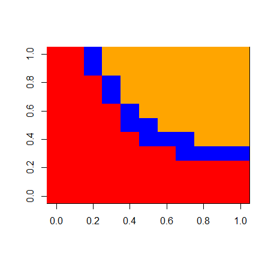

##### **Contact des auteurs**
 Gabrielle Bibeau : bibg1101@usherbrooke.ca
 
 Zacharie Scalzo : scaz2701@usherbrooke.ca
 
### **Résumé**
  100 mots max

## Introduction

Tout être vivant qui est hétérotrophe doit se nourir pour survivre. Ces individus ont alors des relation consommateur-ressource. Ils consomment une ressource disponible dans leur environnement et la convertissent en énergie qu'ils utilisent généralement dans le but ultime de se reproduire et donc, de passer leurs gènes à la génération suivante. Parfois, cette ressource est un autre hétérotrophe. Dansce cas, c'est plus spécifiquement une relation proie-prédateur qui occure. Ces relation ont un effet non négligeable sur la taille des populations de ces espèces dans une communauté (source?).

Dans une communauté écologique, il y a plusieurs espèces fauniques, fongiques et floristiques. Elles ont des relations du type Consommateur-resource entre elles. Ces relations forment de grands réseaux reliant toutes les espèces entre elles que l'on nomme réseau trophique. Un exemple bien connu de réseau trophique est celui du milieu marin. On retrouve tout en bas de la chaine alimentaire le phytoplancton, un autotrophe. Il se fait manger par le premier niveau de consommateurs, par exemple le zooplancton herbivore. Un deuxième niveau de consommateurs, notamment des petits poissons, se nourrisent du zooplancton. Une espèce peu faire partie de plusieurs niveaux trophiques en consommant différentes ressources (biotiques et abiotiques). Il est alors question de prédation intraguilde (PIG). En d'autres mots, il y a deux consommateurs d'une même ressource qui entre eux ont une relation proie-prédateurs.

Dans le passé, plusieurs modèle ont été développés pour illustrer ces relations. Il y a le modèle consommateur-ressource, une généralisation de plusieurs modèles dont le modèle proie-prédateur de Lotka-Voltera. R.D. Holt et G.A. Polis (1996) ont bonifié ce modèle de PIG (une resource consommée par une proie et un prédateur). Ils ont trouvé que cet ajoût menait à plusieurs équilibres de populations instables. 

Nos objectifs sont de déterminer les équilibres alternatifs qui existent dans un cas de PIG complexe comprenant une ressource et trois utilisateurs (proie, prédateur et prédateur suprême) et de comparer ces équilibres avec ceux du modèle de R.D. Holt et G.A. Polis (1996) basé sur Lotka-Voltera. Nous croyons que ...Hypothèses


  

## Méthode

Nous nous sommes basés sur le modèle Lotka-Voltera avec PIG créé par R.D. Holt et G.A. Polis (1996) pour bâtir notre modèle plus complexe avec trois consommateurs.

Ce modèle de référence est définit par le système suivant :
$$
\frac{dP}{dt} = P(b'a'R + \beta\alpha N - m');
$$ 
$$
\frac{dN}{dt} = N(abR - \alpha P - m);
$$ 
$$
\frac{dR}{dt} = R(r(1 - \frac{R}{K}) - aN - a'P).
$$ 

Les variables dans ces équations sont définies comme suit :
$P$ : la densité du prédateur;
$N$ : la densité de la la proie;
$R$ : la densité de la ressource commune;
$a$ : la réponse fonctionnelle de la proie vers la ressource commune;
$a'$ : la réponse fonctionnelle du prédateur vers la ressource commune;
$\alpha$ : le taux de mortalité de la proie causée par le prédateur;
$b$ : le taux de conversion de la consommation de la ressource vers la reproduction de la proie;
$b'$ : le taux de conversion de la consommation de la ressource vers la reproduction du prédateur;
$\beta$ : le taux de conversion de la consommation de la proie vers la reproduction du prédateur;
$K$ : la quantité de ressource commune lorsqu'elle est stable;
$m$ : le taux de mortalité densité-dépendant de la proie;
$m'$ : le taux de mortalité densité-dépendant du prédateur;
$r$ : le taux de croissance de la ressource commune.

Ce modèle comporte plusieurs suppositions : 
1. Le prédateur est dépendant de deux sources d'alimentation : la proie et la ressource commune. La proie est seulement dépendante de la ressource commune.

1. La ressource commune croit en suivant une courbe logistique. 

1. La portion du taux de croissance du prédateur permis par la consommation de la proie est plus grande que 0. 

1. Le prédateur bénéficie des effets positifs de la consommation de la proie de façon instannée. 

1. La proie est meilleure que le prédateur dans l'exploitation de la ressource commune.

1. Les réponses fonctionnelles sont des intéractions linéaires et les taux de croissance des populations sont proportionnels aux taux de consommation. 


Notre modèle ajoute plusieurs variables au modèle de R.D. Holt et G.A. Polis (1996) pour le complexifier :
$a''$ : la réponse fonctionnelle du prédateur suprême vers la ressource commune;
$b''$ : le taux de conversion de la consommation de la ressource vers la reproduction du prédateur suprême;
$m''$ : le taux de mortalité densité-dépendant du prédateur suprême;
$\psi$ : le taux de conversion de la consommation du prédateur vers la reproduction du prédateur suprême;
$\phi$ : le taux de conversion de la consommation de la proie vers la reproduction du prédateur suprême;
$\gamma$ : la réponse fonctionnelle du prédateur suprême vers le prédateur;
$\delta$ : la réponse fonctionnelle du prédateur suprême vers la proie.

Il est décrit par le système d'équations suivant :
$$
\frac{dS}{dt} = S(b''a''R + \phi\delta N - \psi\gamma P - m'');
$$ 
$$
\frac{dP}{dt} = P(b'a'R + \beta\alpha N - \gamma S - m');
$$ 
$$
\frac{dN}{dt} = N(abR - \alpha P - \delta S - m);
$$ 
$$
\frac{dR}{dt} = R(r(1 - \frac{R}{K}) - aN - a'P - a''S).
$$ 

Ce modèle amène alors des suppositions supplémentaires à celles nommées précédemment :

1. Le prédateur suprême est dépendant de trois sources d'alimentation : le prédateur, la proie et la ressource commune. 
 
1. La portion du taux de croissance du prédateur suprême permis par la consommation du prédateur ainsi que la portion  permis par la consommation de la proie sont plus grandes que 0.

1. Le prédateur suprême bénéficie des effets positifs de la consommation de la proie et du prédateur de façon instannée. 

1. Le prédateur est meilleur que le prédateur suprême dans l'exploitation de la ressource commune.


Les valeurs des paramètres utilisés dans la création de la figure sont inspirés de G. A. Polis (1991) et R.D. Holt et G.A. Polis (1996).

https://www-jstor-org.ezproxy.usherbrooke.ca/stable/pdf/2462536.pdf?refreqid=fastly-default%3A9480c9be0a6e17f24489f73ed3d34306&ab_segments=&origin=&initiator=&acceptTC=1

Les calculs permettant d'illustrer les équilibres dans la communauté sont les suivants : 

```{r, eval=FALSE}
library(deSolve)


#Fonction
SuperPred <- function(t, ConI, parms = c(a,a_prime,alpha,b,b_prime,
                                    beta,K,m,m_prime,r, 
                                    a_doubleprime, gamma, delta, b_doubleprime, phi, psi, m_doubleprime)){
  
  with(as.list(ConI, parms), {
    # Lotka-voltera
    dS <- S*(b_doubleprime*a_doubleprime*R + phi*delta*N + psi*gamma*P - m_doubleprime) #dS/dt
    dP <- P*(b_prime*a_prime*R + beta*alpha*N - m_prime - gamma*S) # dP/dt
    dN <- N*(a*b*R - m - alpha*P - delta*S) #dN/dt
    dR <- R*(r*(1- (R/K)) - a*N - a_prime*P - a_doubleprime*S) #dR/dt
    
    # Resultat
    res <- c(dS = dS, dP = dP, dN = dN, dR = dR)
    return(list(res))
  })
}


#Conditions initiales
S0 <- 0.2
P0 <- 0.2
N0 <- 0.2
R0 <- 1 - P0 - N0 - S0
CI_SuperPred <- c(S=S0, P=P0, N=N0, R=R0)


#Boucle d'équilibre
figure_1 <- matrix(0.5, 11, 11)
lim <- 0.01
steps <- 100

for(i in 0:10){
  for(j in 0:10){
    
    parametre_SuperPred <- c(a   <- 1,
                             a_prime   <- 0.8,
                             alpha     <- 1,
                             b         <- 1,
                             b_prime   <- 0.7,
                             beta      <- 1,
                             K         <- 1,
                             m         <- 0.5,
                             m_prime   <- 0.5,
                             r         <- 1,
                             a_doubleprime <- i/10,
                             gamma     <- 0.4,
                             delta     <- 0.4,
                             b_doubleprime <- j/10,
                             phi       <- 0.8,
                             psi       <- 0.8, 
                             m_doubleprime <- 0.2)
    
    SuperPred_sol <- ode(y=CI_SuperPred, times= seq(1,100), func= SuperPred, parms= parametre_SuperPred)
    
    if(SuperPred_sol[steps,'S'] > 0 & SuperPred_sol[steps,'P'] > lim & SuperPred_sol[steps,'N'] > lim){ #1 (red)
      figure_1[i+1,j+1] <- 0.5
      
    }else if(SuperPred_sol[steps,'S'] < 0 & SuperPred_sol[steps,'P'] > lim & SuperPred_sol[steps,'N'] > lim){ #2 (yellow)
      figure_1[i+1,j+1] <- 1.5
      
    }else if(SuperPred_sol[steps,'S'] > 0 & SuperPred_sol[steps,'P'] < lim & SuperPred_sol[steps,'N'] > lim){ ##3 (blue)
      figure_1[i+1,j+1] <- 2.5
      
    }else if(SuperPred_sol[steps,'S'] > 0 & SuperPred_sol[steps,'P'] > lim & SuperPred_sol[steps,'N'] < lim){ #4 (green)
      figure_1[i+1,j+1] <- 3.5
      
    }else if(SuperPred_sol[steps,'S'] < 0 & SuperPred_sol[steps,'P'] < lim & SuperPred_sol[steps,'N'] > lim){ #5 (pink)
      figure_1[i+1,j+1] <- 4.5
      
    }else if(SuperPred_sol[steps,'S'] > 0 & SuperPred_sol[steps,'P'] < lim & SuperPred_sol[steps,'N'] < lim){ #6 (orange)
      figure_1[i+1,j+1] <- 5.5
      
    }else if(SuperPred_sol[steps,'S'] < 0 & SuperPred_sol[steps,'P'] > lim & SuperPred_sol[steps,'N'] < lim){ #7 (cyan)
      figure_1[i+1,j+1] <- 6.5
      
    }
  }
}


image (figure_1, col = c("red", "yellow", "blue", "green", "pink", "orange", "cyan" ), breaks = 0:7, xlab = 'b_doubleprime' , ylab = 'a_doubleprime')
#legend(x = 'bottomleft', legend = c('Proie IG exclu','Coexistance stable', 'Prédateur IG exclu'), fill = 1:3)

```


## Résultats 

La figure résultant des calculs est la suivante :


Dans cette figure, les paramètres $a''$ et $b''$ ont été variés entre 0 et 1, alors que les suivants ont été gardés constants : 

$a = 1$

$a' = 0.8$

$\alpha = 1$

$b = 1$

$b' = 0.7$

$\beta = 1$

$K = 1$

$m = 0.5$

$m' = 0.5$

$m'' = 0.2$

$r = 1$

$\gamma = 0.4$

$\delta = 0.4$

$\phi = 0.8$

$\psi = 0.8$


## Discussion


## Références
