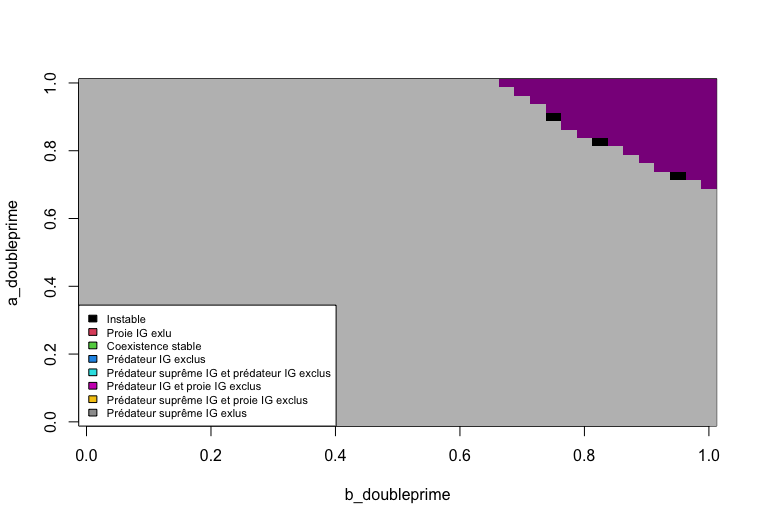
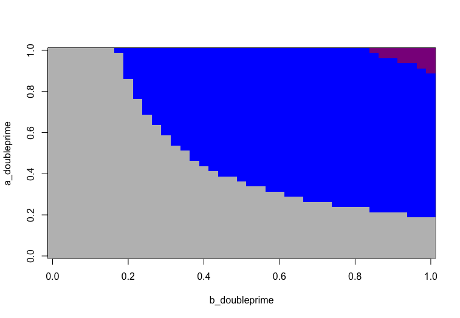
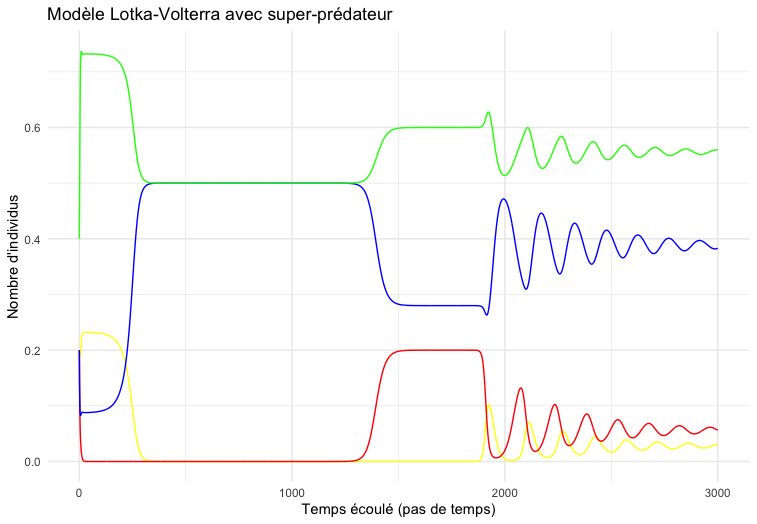

##### **Contact des auteurs**
 Gabrielle Bibeau : bibg1101@usherbrooke.ca
 
 Zacharie Scalzo : scaz2701@usherbrooke.ca
 
### **Résumé**
Les réseaux trophiques sont rarement modélisés avec l'immense complexité des écosystèmes (@polis_complex_1991). Pour illustrer la différence qu'apporte une espèce supplémentaire à un système, nous avons modifié le modèle proie-prédateur de Lotka-Voltera bonifié de prédation intraguilde (PIG) simple par @holt_theoretical_1997 pour créer un modèle de PIG avec une ressource commune, une proie IG (consomme la ressource), un prédateur IG (consomme la ressource et la proie) et un prédateur suprême IG (consomme tous les autres). Nous avons démontré qu'il existe plusieurs états d'équilibre dans cette communauté, et qu'un prédateur suprême IG omnivore peut être régulateur.

## Introduction

Tout être vivant hétérotrophe doit se nourrir pour survivre. Ces individus ont alors des relations consommateur-ressource. Ils consomment une ressource disponible dans leur environnement et la convertissent en énergie qu'ils utilisent pour survivre, et ce pour se reproduire. Ces relations ont un effet non négligeable sur la taille des populations de ces espèces dans une communauté (@andersson_influence_1977). 

Dans une communauté écologique, il y a plusieurs espèces fauniques, fongiques et floristiques. Il existe donc plusieurs différentes relations du type consommateur-ressource entre elles. Ces relations forment de grands réseaux reliant toutes les espèces entre elles que l'on nomme réseau trophique. Un exemple bien documenté de réseau trophique complexe est celui de la vallée de Coachella en Californie. Toutes les espèces y vivant sont interreliées parce qu'elles se consomment entre-elles et font même, pour certaines, du cannibalisme. Contrairement à ce que les cas théoriques populaires modélisent, une espèce peut faire partie de plusieurs niveaux trophiques en consommant différentes ressources biotiques (omnivorie). Il est alors question de PIG. En d'autres mots, il y a minimalement deux consommateurs d'une même ressource qui entre eux ont une relation proie-prédateur. 

Dans le passé, plusieurs modèles ont été développés pour illustrer ces relations. Il y a le modèle consommateur-ressource, une généralisation de plusieurs modèles dont le modèle proie-prédateur de Lotka-Voltera. @holt_theoretical_1997 ont bonifié ce dernier de PIG (une ressource consommée par une proie IG et un prédateur IG). Ils ont trouvé que cet ajout menait à 4 états d'équilibres : une absence totale de proie IG, une absence totale de prédateur IG, un équilibre instable et une coexistence. Nos objectifs sont de déterminer les équilibres alternatifs qui existent dans un cas de PIG complexe comprenant une ressource et trois utilisateurs (proie IG, prédateur IG et prédateur suprême IG). En d'autres mots, nous avons introduit un prédateur suprême IG opportuniste (qui veut autant manger le prédateur IG que la proie IG) au modèle de @holt_theoretical_1997 basé sur Lotka-Voltera, puis fait varier le type de prédateur suprême IG pour voir si cela amenait des changements dans les états d'équilibre. Nous testerons quatre types de prédateurs suprêmes IG différents:

Prédateur suprême IG de type 1: le prédateur suprême IG est très bien adapté à la consommation du prédateur IG et de la proie IG. Il les convertit efficacement en nouveaux individus. 

Prédateur suprême IG de type 2: le prédateur suprême IG est très bien adapté à la consommation du prédateur IG, et peu adapté, pour la proie IG. Il convertit efficacement seulement le prédateur IG en en nouveaux individus.

Prédateur suprême IG de type 3: le prédateur suprême IG est très bien adapté à la consommation de la proie IG, et peu adapté, pour le prédateur IG. Il convertit efficacement seulement la proie IG en nouveaux individus.

Prédateur suprême IG de type 4: le prédateur suprême IG n'est pas bien adapté à la consommation ni du prédateur IG, ni de la proie IG. Il convertit peu efficacement ces derniers en nouveaux individus. Il est donc plus dépendant de la ressource pour se nourrir.

Voici un schéma qui illustre notre modèle : 


Nous croyons que l'ajout d'un prédateur suprême IG dans l'écosystème permettra plusieurs états alternatifs d'équilibres. Toutefois, l'état qui sera le plus présent est un équilibre stable de coexistence entre les quatre partis. En se basant sur l'article de @andersson_influence_1977 qui avance que l'ajout d'omnivores généralistes a tendance à stabiliser la coexistence dans une communauté, il est logique que notre modèle de PIG avec prédateur suprême IG permette d'observer plus de cas de coexistence que le modèle de PIG simple de @holt_theoretical_1997. 


## Méthode

Nous nous sommes basés sur le modèle Lotka-Voltera avec PIG créé par @holt_theoretical_1997 pour bâtir notre modèle plus complexe avec trois consommateurs.

Ce modèle de référence est défini par le système suivant :
$$
\frac{dP}{dt} = P(b'a'R + \beta\alpha N - m');
$$ 
$$
\frac{dN}{dt} = N(abR - \alpha P - m);
$$ 
$$
\frac{dR}{dt} = R(r(1 - \frac{R}{K}) - aN - a'P).
$$ 

Les variables dans ces équations sont définies comme suit :
$P$ : densité du prédateur IG;
$N$ : densité de la la proie IG;
$R$ : densité de la ressource commune;
$a$ : réponse fonctionnelle de la proie IG vers la ressource commune;
$a'$ : réponse fonctionnelle du prédateur IG vers la ressource commune;
$\alpha$ : taux de mortalité de la proie IG causée par le prédateur IG;
$b$ : taux de conversion de la consommation de la ressource vers la reproduction de la proie IG;
$b'$ : taux de conversion de la consommation de la ressource vers la reproduction du prédateur IG;
$\beta$ : taux de conversion de la consommation de la proie IG vers la reproduction du prédateur IG;
$K$ : quantité de ressource commune lorsqu'elle est stable;
$m$ : taux de mortalité densité-dépendant de la proie IG;
$m'$ : taux de mortalité densité-dépendant du prédateur IG;
$r$ : taux de croissance de la ressource commune.

Le modèle de @holt_theoretical_1997 comportait plusieurs suppositions : 
1. Le prédateur IG est dépendant de deux sources d'alimentation : la proie IG et la ressource commune. Sa préférence entre les deux est variable. La proie IG est seulement dépendante de la ressource commune. 

2. La ressource commune croit en suivant une courbe logistique. 

3. La portion du taux de croissance du prédateur IG permise par la consommation de la proie est plus grande que 0. 

4. Le prédateur IG bénéficie des effets positifs de la consommation de la proie IG de façon instantanée. 

5. Les réponses fonctionnelles sont des interactions linéaires et les taux de croissance des populations sont proportionnels aux taux de consommation. 


Notre modèle ajoute plusieurs variables au modèle de @holt_theoretical_1997 pour le complexifier :
$a''$ : réponse fonctionnelle du prédateur suprême IG vers la ressource commune;
$b''$ : taux de conversion de la consommation de la ressource vers la reproduction du prédateur suprême IG;
$m''$ : taux de mortalité densité-dépendant du prédateur suprême IG;
$\psi$ : taux de conversion de la consommation du prédateur IG vers la reproduction du prédateur suprême IG;
$\phi$ : taux de conversion de la consommation de la proie IG vers la reproduction du prédateur suprême IG;
$\gamma$ : réponse fonctionnelle du prédateur suprême IG vers le prédateur;
$\delta$ : réponse fonctionnelle du prédateur suprême IG vers la proie IG.

Notre modèle avec prédation suprême est décrit par le système d'équations suivant :

$$
\frac{dS}{dt} = S(b''a''R + \phi\delta N - \psi\gamma P - m'');
$$ 
$$
\frac{dP}{dt} = P(b'a'R + \beta\alpha N - \gamma S - m');
$$ 
$$
\frac{dN}{dt} = N(abR - \alpha P - \delta S - m);
$$ 
$$
\frac{dR}{dt} = R(r(1 - \frac{R}{K}) - aN - a'P - a''S).
$$ 

Ce modèle amène des suppositions supplémentaires à celles nommées précédemment :

6. Le prédateur suprême IG est dépendant de trois sources d'alimentation : le prédateur IG, la proie IG et la ressource commune.

7. Le prédateur suprême IG n'a pas de préférence entre le prédateur IG et la proie IG. Ces derniers subissent donc proportionnellement la même mortalité liée au prédateur suprême IG.
 
8. La portion du taux de croissance du prédateur suprême IG permise par la consommation du prédateur IG ainsi que la portion permise par la consommation de la proie sont plus grandes que 0.

9. Le prédateur suprême IG bénéficie des effets positifs de la consommation de la proie et du prédateur instantanément.

Voici la procédure pour initialiser le modèle Lotka-Volterra avec PIG complexe :

```{r, eval=FALSE}
library(deSolve)

#Fonction
SuperPred <- function(t, ConI, parms = c(a,a_prime,alpha,b,b_prime,
                                    beta,K,m,m_prime,r, 
                                    a_doubleprime, gamma, delta, b_doubleprime, phi, psi, m_doubleprime)){
  
  with(as.list(ConI, parms), {
    # Lotka-voltera
    dS <- S*(b_doubleprime*a_doubleprime*R + phi*delta*N + psi*gamma*P - m_doubleprime) #dS/dt
    dP <- P*(b_prime*a_prime*R + beta*alpha*N - m_prime - gamma*S) # dP/dt
    dN <- N*(a*b*R - m - alpha*P - delta*S) #dN/dt
    dR <- R*(r*(1- (R/K)) - a*N - a_prime*P - a_doubleprime*S) #dR/dt
    
    # Resultat
    res <- c(dS = dS, dP = dP, dN = dN, dR = dR)
    return(list(res))
  })
}
```


Voici la procédure pour modéliser l'équation différentielle de Lotka-Volterra avec PIG complexe et générer les figures 4 et 5. Comme exemple de calcul, ces lignes permettent de générer la figure 4.1:

```{r, eval=FALSE}
#Conditions initiales
S0 <- 0.2
P0 <- 0.2
N0 <- 0.2
R0 <- 1 - P0 - N0 - S0
CI_SuperPred <- c(S=S0, P=P0, N=N0, R=R0)

#Boucle d'équilibre (exemple de la figure 2, aux conditions A, avec un super-prédateur de type 1 )

steps <- 700 #Nombre de pas de temps. A été augmenté pour accomoder des cycles qui s'atténuent plus lentement.

grain <- 40 ##Résolution de l'image. Un compromis a été fait en la précision et la vitesse d'éxécution du code: un grain plus élevé aurait été souhaitable, mais nous ne croyons pas que cela ai changé drastiquement les résultats.

lim <- 0.01#Puisque le résultat de l'équation différentiel peut s'approcher de 0 sans ne jamais l'atteindre, les conditions P, N et R = 0 peuvent ne jamais être atteinte. La mise en place d'une limite où on assume que la densité P, N ou R est égal à 0 permet de modéliser les différents étapes d'équilibre.

limsd <- 0.0001 #Pour vérifier si la fonction est à l'équilibre ou non, nous comparons l'écart type des derniers 10% des termes à un écart-type que nous jugeons représentatif d'un système à l'équilibre, ou en voie de le devenir (Fig X). 

i <- 1
j <- 1


figure_1 <- matrix(0.5, grain +1 , grain +1)

maxsd<- 0 # Paramètre d'une fonction qui trouve la plus grande instabilité. Elle enregistre le plus grand écart-type des 10 derniers pourcent.
maxi <- 0 # Paramètre qui enregistre la valeur de a' où est généré la plus grande instabilité
maxj <- 0 # Paramètre qui enregistre la valeur de b' où est généré la plus grande instabilité

prog <- 0 #Marqueur de progression du code pour mieux paramétrer le grain et les pas de temps (steps)

for(i in 0:grain){
  for(j in 0:grain){
    
    #Fonction qui marque la progression dans la console
    prog <- prog + 1
    print(paste("progress:", prog*100/((grain + 1)*(grain+1)), "%")) #
    
    
    parametre_SuperPred <- c(a   <- 1,
                             a_prime   <- 0.6,
                             alpha     <- 0.5,
                             b         <- 1,
                             b_prime   <- 1,
                             beta      <- 1,
                             K         <- 1,
                             m         <- 0.5,
                             m_prime   <- 0.5,
                             r         <- 1,
                             gamma     <- 1,
                             delta     <- 1,
                             phi       <- 1,
                             psi       <- 1, 
                             m_doubleprime <- 0.5,
                              a_doubleprime <- i/grain,
                              b_doubleprime <- j/grain)
    
    
    SuperPred_sol <- ode(y=CI_SuperPred, times= seq(1,steps), func= SuperPred, parms= parametre_SuperPred)
    
    if(sd(SuperPred_sol[(0.95*steps):steps,'S']) > limsd | sd(SuperPred_sol[(0.95*steps):steps,'P']) > limsd | sd(SuperPred_sol[(0.95*steps):steps,'N']) > limsd){
      figure_1[i+1,j+1] <- 0.5 #Instable, noir
      
       # Fonction qui trouve l'endroit avec le plus d'instabilité
      if(sd(SuperPred_sol[(0.9*steps):steps,'P']) > maxsd){
        maxsd <- sd(SuperPred_sol[(0.9*steps):steps,'P'])
        maxi <- i
        maxj <- j
        if(sd(SuperPred_sol[(0.9*steps):steps,'N']) > maxsd){
          maxsd <- sd(SuperPred_sol[(0.9*steps):steps,'N'])
          maxi <- i
          maxj <- j
          if(sd(SuperPred_sol[(0.9*steps):steps,'S']) > maxsd){
            maxsd <- sd(SuperPred_sol[(0.9*steps):steps,'S'])
            maxi <- i
            maxj <- j
            
          }
        }
      }
    
    }else if(SuperPred_sol[steps,'S'] > lim & SuperPred_sol[steps,'P'] > lim & SuperPred_sol[steps,'N'] < lim){ #Proie IG exlu, rouge
      figure_1[i+1,j+1] <- 1.5
      
    }else if(SuperPred_sol[steps,'S'] > lim & SuperPred_sol[steps,'P'] > lim & SuperPred_sol[steps,'N'] > lim){ #Coexistence stable, chartreuse
      figure_1[i+1,j+1] <- 2.5
      
    }else if(SuperPred_sol[steps,'S'] > lim & SuperPred_sol[steps,'P'] < lim & SuperPred_sol[steps,'N'] > lim){ #Prédateur IG exclu, bleu
      figure_1[i+1,j+1] <- 3.5
      
    }else if(SuperPred_sol[steps,'S'] < lim & SuperPred_sol[steps,'P'] < lim & SuperPred_sol[steps,'N'] > lim){ #prédateur suprême IG et prédateur IG exclus, cyan
      figure_1[i+1,j+1] <- 4.5
      
    }else if(SuperPred_sol[steps,'S'] > lim & SuperPred_sol[steps,'P'] < lim & SuperPred_sol[steps,'N'] < lim){ #Prédateur IG et proie IG exclus, Magenta foncé
      figure_1[i+1,j+1] <- 5.5
      
    }else if(SuperPred_sol[steps,'S'] < lim & SuperPred_sol[steps,'P'] > lim & SuperPred_sol[steps,'N'] < lim){ #prédateur suprême IG et proie IG exlue, Or
      figure_1[i+1,j+1] <- 6.5
      
    }else if(SuperPred_sol[steps,'S'] < lim & SuperPred_sol[steps,'P'] > lim & SuperPred_sol[steps,'N'] > lim){ #prédateur suprême IG exclue, gris
      figure_1[i+1,j+1] <- 7.5
      
    }
  }
}

image (figure_1, col = c("black", "red", "chartreuse4", "blue", "cyan", "darkmagenta", "gold","grey" ), breaks = 0:8, 
       xlab = 'b_doubleprime' , ylab = 'a_doubleprime')
legend('bottomleft', legend = c('Instable',
                                    'Proie IG exlu',
                                    'Coexistence stable',
                                    'Prédateur IG exclus',
                                    'prédateur suprême IG et prédateur IG exclus',
                                    'Prédateur IG et proie IG exclus',
                                    'prédateur suprême IG et proie IG exclus',
                                    'prédateur suprême IG exlus'),cex=0.7, fill = 1:8)
```

Pour les figures 4.1 à 4.4, les variables sont fixées aux conditions énumérées dans la première figure de l'étude originale (@holt_theoretical_1997), soit: $a = 1$, $\alpha = 0.5$, $b = 1$, $\beta = 1$, $K = 1$, $m = 0.5$, $m' = 0.5$ et $r = 1$. Dans cette étude, les variables $a'$ et $b'$ variait de 0 à 1 pour modéliser le changement d'état d'équilibre en fonction de la réponse fonctionnelle du prédateur IG à la ressource commune et la conversion de ressource en reproduction du prédateur IG. Nous avons choisi de fixer $a'$ et $b'$ à des valeurs qui, selon le modèle de PIG simple, génère une coexistence à l'équilibre entre les trois espèces, soit 1 et 0.6 respectivement (Figure 2 et 3). 

Les figures montrant la dynamique de la population des 4 espèces ont été générées à l'aide du code suivant (instabilité du modèle, figure 4.1).

```{r, eval=FALSE}

parametre_SuperPred <- c(a   <- 1,
                         a_prime   <- 0.6,
                         alpha     <- 0.5,
                         b         <- 1,
                         b_prime   <- 1,
                         beta      <- 1,
                         K         <- 1,
                         m         <- 0.5,
                         m_prime   <- 0.5,
                         r         <- 1,
                         gamma     <- 1,
                         delta     <- 1,
                         phi       <- 1,
                         psi       <- 1, 
                         m_doubleprime <- 0.5,
                         a_doubleprime <- maxi/grain, #maxi est défini selon la plus grande écart-type observé dans la création de l'image, dans                                                             l'axe des y.
                         b_doubleprime <- maxj/grain) #maxj est défini selon la plus grande écart-type observé dans la création de l'image, dans                                                             l'axe des x.

SuperPred_sol <- ode(y=CI_SuperPred, times= seq(1,3000), func= SuperPred, parms= parametre_SuperPred)


ggplot() +
  geom_line(aes(SuperPred_sol[,'time'], SuperPred_sol[,'S']), color = 'yellow') +
  geom_line(aes(SuperPred_sol[,'time'], SuperPred_sol[,'P']), color = 'red') +
  geom_line(aes(SuperPred_sol[,'time'], SuperPred_sol[,'N']), color = 'blue') +
  geom_line(aes(SuperPred_sol[,'time'], SuperPred_sol[,'R']), color = 'green') +
  labs(title = "Modèle Lotka-Volterra avec super-prédateur", x = "Temps écoulé (pas de temps)", y = "Nombre d'individus") +
  theme_minimal()
```


Les variables $b''$ et $a''$ reprennent donc le rôle de $a'$ et $b'$, soit la réponse fonctionnelle du prédateur suprême IG à la ressource commune et la conversion de ressources en reproduction du prédateur suprême IG. Elles varient de 0 à 1.

Les autres variables représentent le prédateur suprême IG opportuniste: $\gamma = 1$, $\delta = 1$ et $m'' = 0.5$. Les variables $\phi$ et $\psi$ varie en fonction du type de prédateur suprême IG. Pour le prédateur suprême IG de type 1, $\phi$ et $\psi$ valent toutes deux 1: le prédateur suprême IG convertit efficacement le prédateur et la proie en reproduction. Pour le prédateur suprême IG de type 2, $\phi$ et $\psi$ valent respectivement 0.2 et 1: le prédateur suprême IG convertit efficacement le prédateur IG en reproduction, mais pas la proie IG. Pour le prédateur suprême IG de type 3, $\phi$ et $\psi$ valent respectivement 1 et 0.2: le prédateur suprême IG convertit efficacement la proie IG en reproduction, mais pas le prédateur IG. Finalement, pour le prédateur suprême IG de type 1, $\phi$ et $\psi$ valent tous deux 0.2: le prédateur suprême IG ne convertit pas efficacement les deux autres espèces en reproduction.

Pour les figures 5.1 à 5.4, les conditions énumérées précédemment ne changent pas, à l'exception des paramètres suivants: les valeurs $\alpha$ et $m$ sont fixées à 1 et 0.1 respectivement.


## Résultats 
Voici les figures selon les paramètres de la figure 1.A dans @holt_theoretical_1997, avec les quatre types de prédateurs suprêmes IG.





Voici les figures selon les conditions de la figure 1.B dans @holt_theoretical_1997, avec les quatre types de prédateurs suprêmes IG.  





## Interprétation biologique 
###1. Interprétation des figures 4.1 à 4.4
#### Figure 4.1
Il est possible de remarquer plusieurs états d'équilibre différents sur la figure 4.1, soit de gauche-bas à haut-droite: le prédateur suprême IG exclu, une coexistence stable, le prédateur IG exclu ainsi que le prédateur IG et la proie IG exclus. La transition entre les 3 premiers états d'équilibre énumérés est parsemée d'instabilités. Dans le quadrant en bas à gauche, le prédateur suprême de type 1 est très peu compétitif pour s'accaparer et profiter de la ressource commune, ce qui explique son exclusion. Plus il est compétitif, plus il prend de la place dans l'environnement, coexistant d'abord avec le prédateur IG et la proie IG, et ensuite en les excluant complètement, le prédateur en premier.  

Les instabilités semblent être aux transitions avec l'état d'équilibre de coexistence. Il est à noter que @holt_theoretical_1997 avaient prédit ce phénomène dans leur modèle proie-prédateur de Lotka-Voltera bonifié de PIG. Par contre, les régions d'instabilités sur la figure sont difficilement interprétables: elles semblent vouloir se stabiliser à long terme, mais ont un écart-type supérieur à 0.0001 (figure 6).


On pourrait donc supposer que plus le prédateur suprême IG de type 1 est adapté à la ressource, plus il est compétitif et capable d'exclure complètement les autres hétérotrophes de la communauté. Ceci pourrait être dû à sa grande capacité à profiter des bénéfices de s'alimenter de ces derniers.

#### Figure 4.2
La figure 4.2 ressemble beaucoup à la figure 4.1, mais la zone d'exclusion du prédateur suprême IG est beaucoup plus grande. Le prédateur IG n'est jamais le seul à être exclu: étrangement, il semble être exclu, pour une petite région de la figure, avec le prédateur suprême IG. Ceci pourrait être expliquer par le prédateur suprême IG qui dévore les prédateurs IG à un tel point que sa survie en est affectée: il est ensuite incapable de compétitionner avec la proie IG pour la ressource (Figure 7).


Or, si on augmente de 10 fois le nombre de pas, nous obtenons une coexistence qui approche l'équilibre (Figure 8).


Néanmoins, le prédateur suprême IG est grandement déprécié en nombre dans cette situation. Ce changement d'état selon le pas de temps se répète dans la zone où il y a le plus d'instabilité (écart-type le plus grand). Ceci suggère qu'un pas de temps plus grand que ce que nous avons, prédit mieux les tendances à long terme.

En résumé, le prédateur suprême IG de type 2 semble beaucoup moins compétitif s'il est mal adapté à consommer la ressource. Il n'y a pas de coexistence, mais ceci pourrait être dû au choix du pas de temps. Lorsqu'il est très compétitif, le prédateur suprême IG supplante tous les autres.

#### Figure 4.3
La figure 4.3 suit la même logique que les deux autres figures, mais avec l'absence de zones d'instabilité. En effet, l'état d'équilibre transitionne drastiquement d'un état à un autre. Cela pourrait être dû au fait que le prédateur suprême IG de type 3 exclue rapidement le prédateur IG en s'accaparant de la proie IG, sans coexistence possible. Finalement, lorsque le prédateur suprême IG devient très bien adapté à la ressource, il exclut tous les autres.

#### Figure 4.4
La figure 4.3 suit la même logique que les trois autres figures, mais avec l'absence de zones d'exclusion du prédateur IG seulement et de coexistence stable. De plus, la zone d'exclusion du prédateur suprême IG de type 4 est la plus grande, suggérant que lorsqu'il est peu adapté à consommer le prédateur IG et la proie IG, il ne peut compétitionner pour la ressource. Lorsqu'il devient compétitif pour consommer la ressource, il supplante les deux autres hétérotrophes. 

Il y a quelques zones d'instabilité, mais suite à une analyse plus approfondie, il s'agit d'une erreur causée par le choix du pas de temps. En effet, il s'agirait plutôt de zone où le prédateur suprême IG et la proie IG sont exclus, comme dans la figure 4.2. (Figure 9)


###2. Interprétation des figure 5.1 à 5.4
#### Figure 5.1
La figure 5.1 représente un cas où le prédateur IG de type 1 est complètement absent. De cette façon, elle est presque identique à la figure 1B de notre interprétation du modèle proie-prédateur de Lotka-Voltera bonifié de PIG par R.D. Holt et G.A. Polis (1997). Il se pourrait que le succès du prédateur IG qui possède une plus grande réponse fonctionnelle à la proie, et celle-ci, un taux de mortalité plus bas, bonifie le prédateur suprême IG avec une abondance de ressource qui le rend trop nombreux. Ceci pourrait rendre le prédateur suprême IG trop dangereux pour le prédateur IG, menant à son exclusion. La dynamique de population à l'état d'équilibre d'exclusion du prédateur suprême IG semble corroborer (Figure 10).


#### Figure 5.2
La figure 5.2 possède une énorme zone de coexistence, ainsi qu'une zone d'exclusion du prédateur suprême IG de type 2 lorsque celui-ci n'est pas compétitif à la consommation de la ressource. La zone d'instabilité est véritable, peu importe le pas de temps (Figure 11).


Ceci suggère que le prédateur suprême IG de type 2 apporte une stabilité au système dans la majorité des cas, en contrôlant la population de prédateur IG. Lorsque le prédateur suprême de type 2 devient très compétitif pour la ressource, la proie IG et le prédateur IG disparaissent. 

#### Figure 5.3
La figure 5.3 suit la même logique que la figure 4.3, mais avec un prédateur suprême IG de type 3 moins compétitif dans la deuxième suite de paramètres. Il se pourrait que le prédateur, bien adapté à consommer la proie, soit capable de résister plus longtemps au prédateur suprême IG de type 3. 

#### Figure 5.3
La figure 5.4 suit la même logique que la figure 4.4, mais avec une zone de coexistence au lieu d'une zone d'exclusion du prédateur IG et de la proie IG. Ceci suggère que la réduction de la mortalité de la proie IG ainsi que l'augmentation de la capacité du prédateur IG à se nourrir de la proie, maintenant plus abondante, soit un bon tampon à un prédateur suprême IG de type 4 très compétitif pour la ressource, mais peu adapté à se nourrir de la proie IG et du prédateur IG. De plus, comparativement à la figure 1B du modèle proie-prédateur de Lotka-Voltera bonifié de PIG par R.D. Holt et G.A. Polis (1997), la proie IG n'est jamais exclue: il semblerait que, lorsque très compétitif pour la ressource, le prédateur suprême IG de type 4 soit capable de contrôler la population de prédateur IG, imposant ainsi une coexistence stable. Une touche d'instabilité lorsque le prédateur suprême IG est à son plus compétitif pour la ressource suggère que, dans cette situation, l'équilibre qu'il impose est fragile.


### Conclusion

En résumé, l'ajout d'un prédateur suprême IG n'a pas augmenté la coexistence de toutes les espèces comparativement au modèle proie-prédateur de Lotka-Voltera bonifié de PIG, mais elle semble avoir favorisé la coexistence du prédateur IG et de la proie IG. En effet, dans certains cas, il semblerait que le prédateur suprême IG joue un rôle de régulateur de la population de prédateurs IG. Cette hypothèse est basée sur le fait qu'aucun état où le prédateur IG exclut le prédateur suprême IG ainsi que la proie IG n'a été observé. Le système prédateur IG - proie IG est souvent tolérant d'un prédateur suprême IG peu compétitif pour la ressource. L'ajout d'un prédateur suprême IG a aussi apporté une plus grande diversité d'état d'équilibre ainsi que, dans de rares occasions, un réel état d'instabilité dans une communauté de proie IG, prédateur IG, ressource commune, et lui-même. Cela corrobore aux résultats de @andersson_influence_1977, selon lesquels l’ajout d’omnivores généralistes tend à stabiliser la coexistence dans une communauté.

Pour conclure, cette étude aurait bénéficié d'un appareil d'analyse plus puissant. En effet, augmenter la résolution des figures ainsi que les pas de temps aurait permis d'avoir une idée plus nette de la réalité des interactions entre les 4 espèces à long terme. Cependant, comme mentionné dans @polis_complex_1991, il est possible qu'en pratique, cela ne soit pas représentatif de la réalité. Une population peut atteindre un seuil critique qui la mènera à l'extinction locale. Nos modèles montrent parfois, comme pour Polis (1991), des espèces dont la population descend à un seuil si bas qu'en nature elle sera éteinte, pour ensuite remonter à une population plus populeuses. De plus, lorsque le nombre de pas de temps est très grand, les paramètres peuvent changer: les processus évolutifs influencent à long terme les communautés, et notre modèle aurait besoin de beaucoup d'équations pour prédire cela.
## Références
