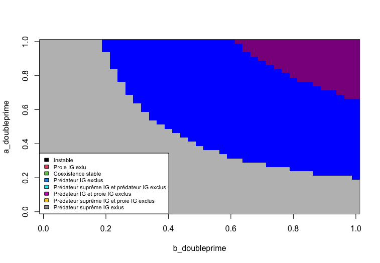
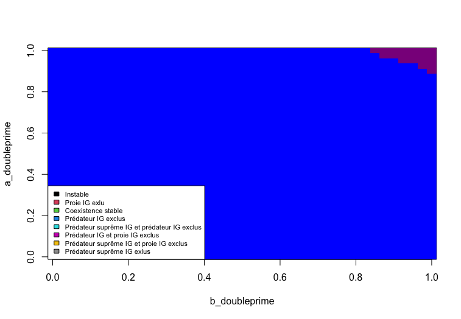

##### **Contact des auteurs**
 Gabrielle Bibeau : bibg1101@usherbrooke.ca
 
 Zacharie Scalzo : scaz2701@usherbrooke.ca
 
### **Résumé**
Les réseaux trophiques ne sont toujours pas modélisés avec précision malgré l'influence indéniable des niveaux trophiques que les différentes populations au sein d'une communauté occupent sur les variations des tailles de ces populations. Nous nous sommes inspirés du modèle proie-prédateur de Lotka-Voltera bonifié de prédation intraguilde simple par @holt_theoretical_1997 pour créer un modèle de prédation intraguilde avec une ressource commune, une proie (consomme la ressource), un prédateur (consomme la ressource et la proie) et un prédateur suprême (consomme tous les autres). Nous avons alors démontré qu'il existe plusieurs états d'équilibre dans cette communauté.

## Introduction

Tout être vivant hétérotrophe doit se nourir pour survivre. Ces individus ont alors des relation consommateur-ressource. Ils consomment une ressource disponible dans leur environnement et la convertissent en énergie qu'ils utilisent pour survivre et ce pour ce reproduire. Parfois, cette ressource est un autre hétérotrophe. Dans ce cas, c'est plus spécifiquement une relation proie-prédateur qui occure. Ces relation ont un effet non négligeable sur la taille des populations de ces espèces dans une communauté (@andersson_influence_1977). 

Dans une communauté écologique, il y a plusieurs espèces fauniques, fongiques et floristiques. Il existe donc plusieurs différentes relations du type consommateur-resource entre elles. Ces relations forment de grands réseaux reliant toutes les espèces entre elles que l'on nomme réseau trophique. Un exemple bien documenté de réseau trophique est celui de la vallée de Coachella en Californie. Ce réseau très complexe comporte presque 200 espèces de plantes vasculaire, environ 150 espèces de vertébrés, une cinquantaine d'espèces d'arachnides, et énormément (tellement qu'on ne peut les compter) d'espèces de microorganismes, d'insectes et de nématodes (@polis_complex_1991). Toutes ces espèces sont inter-reliée parce qu'elles se consomment entre-elles et font même, pour certaines, du cannibalisme. Contrairement à ce que les cas théoriques populaires modélisent, une espèce peut faire partie de plusieurs niveaux trophiques en consommant différentes ressources biotiques (omnivorie). Il est alors question de prédation intraguilde (PIG). En d'autres mots, il y a minimalement deux consommateurs d'une même ressource qui entre eux ont une relation proie-prédateur. Bref, ces grands réseaux trophiques sont si complexes que @polis_complex_1991 juge qu'il est impossible de les étudiés en un seul morceau et les subdivise en six sous-réseaux d'un seulement un est dédié aux vertébrés.

Dans le passé, plusieurs modèle ont été développés pour illustrer ces relations. Il y a le modèle consommateur-ressource, une généralisation de plusieurs modèles dont le modèle proie-prédateur de Lotka-Voltera. @holt_theoretical_1997 ont bonifiés ce dernier de PIG (une resource consommée par une proie et un prédateur). Ils ont trouvé que cet ajoût menait à 4 états d'équilibres : une absence totale de proie intraguilde (IG), une absence totale de prédateur IG, un équilibre instable et une coexistance. Notre modèles précédents ne permettait pas d'atteindre d'instabilité, et ce peut importe les paramètres utilisés. Nous allons donc ne pas tenir en compte les états d'équilibre instable.  Nos objectifs sont de déterminer les équilibres alternatifs qui existent dans un cas de PIG complexe comprenant une ressource et trois utilisateurs (proie, prédateur et prédateur suprême). En d'autres mots, nous avons introduit un prédateur suprême opportuniste (qui veux autant manger le prédateur que la proie) au modèle de @holt_theoretical_1997 basé sur Lotka-Voltera, puis fait varier le type de prédateur pour voir si cela amenait des changement dans les états d'équilibre. Nous considérons que le prédateur est un omnivore, malgrés le nombre restreint d'espèce qu'il consommment. Il n'a pas de préférence entre le prédateur intraguilde et la proie intraguilde. Nous testerons quatre types de prédateur différents:

Super-prédateur IG de type 1: Le super prédateur est très bien adapté à la consommation du prédateur IG et de la proie IG. Il convertit donc efficassement ses derniers en reproduction pour lui même. 

Super-prédateur IG de type 2: Super-prédateur IG de type 3: Le super prédateur est très bien adapté à la consommation du prédateur IG, et peu adapté à la consommation de la proie IG. Il convertit donc efficassement seulement le prédateur IG en reproduction pour lui même.

Super-prédateur IG de type 3: Le super prédateur est très bien adapté à la consommation de la proie IG, et peu adapté à la consommation du prédateur IG. Il convertit donc efficassement seulement la proie IG en reproduction pour lui même.


Super-prédateur IG de type 4: Le super prédateur n'est pas bien adapté à la consommation ni du prédateur IG, ni de la proie IG. Il convertit donc peu efficassement ses derniers en reproduction pour lui même. Il est donc beaucoup plus dépendant de la ressource pour ce nourrir

Voici un schéma ui illustre bien notre modèle : 


Nous croyons que l'ajoût d'un prédateur suprême dans l'écosystème permettra plusieures états alternatifs d'équilibres. Toutefois, l'état qui sera le plus présent est un équilibre stable de coexistance entre les quatres partis. En se basant sur l'article de @andersson_influence_1977 qui avance que l'ajoût d'omnivores généralistes a tendance à stabliser la coexistence dans une communauté, il est logique que notre modèlede PIG avec prédateur suprême permet d'observer plus de cas de coexistance que le modèle de PIG simple de @holt_theoretical_1997. 


## Méthode

Nous nous sommes basés sur le modèle Lotka-Voltera avec PIG créé par @holt_theoretical_1997 pour bâtir notre modèle plus complexe avec trois consommateurs.

Ce modèle de référence est définit par le système suivant :
$$
\frac{dP}{dt} = P(b'a'R + \beta\alpha N - m');
$$ 
$$
\frac{dN}{dt} = N(abR - \alpha P - m);
$$ 
$$
\frac{dR}{dt} = R(r(1 - \frac{R}{K}) - aN - a'P).
$$ 

Les variables dans ces équations sont définies comme suit :
$P$ : la densité du prédateur;
$N$ : la densité de la la proie;
$R$ : la densité de la ressource commune;
$a$ : la réponse fonctionnelle de la proie vers la ressource commune;
$a'$ : la réponse fonctionnelle du prédateur vers la ressource commune;
$\alpha$ : le taux de mortalité de la proie causée par le prédateur;
$b$ : le taux de conversion de la consommation de la ressource vers la reproduction de la proie;
$b'$ : le taux de conversion de la consommation de la ressource vers la reproduction du prédateur;
$\beta$ : le taux de conversion de la consommation de la proie vers la reproduction du prédateur;
$K$ : la quantité de ressource commune lorsqu'elle est stable;
$m$ : le taux de mortalité densité-dépendant de la proie;
$m'$ : le taux de mortalité densité-dépendant du prédateur;
$r$ : le taux de croissance de la ressource commune.

Le modèle de Holt et Polis comportait plusieurs suppositions : 
1. Le prédateur est dépendant de deux sources d'alimentation : la proie et la ressource commune. La proie est seulement dépendante de la ressource commune. Sa préférence entre les deux est variable.

2. La ressource commune croit en suivant une courbe logistique. 

3. La portion du taux de croissance du prédateur permis par la consommation de la proie est plus grande que 0. 

4. Le prédateur bénéficie des effets positifs de la consommation de la proie de façon instannée. 

5. Les réponses fonctionnelles sont des intéractions linéaires et les taux de croissance des populations sont proportionnels aux taux de consommation. 


Notre modèle ajoute plusieurs variables au modèle de @holt_theoretical_1997 pour le complexifier :
$a''$ : la réponse fonctionnelle du prédateur suprême vers la ressource commune;
$b''$ : le taux de conversion de la consommation de la ressource vers la reproduction du prédateur suprême;
$m''$ : le taux de mortalité densité-dépendant du prédateur suprême;
$\psi$ : le taux de conversion de la consommation du prédateur vers la reproduction du prédateur suprême;
$\phi$ : le taux de conversion de la consommation de la proie vers la reproduction du prédateur suprême;
$\gamma$ : la réponse fonctionnelle du prédateur suprême vers le prédateur;
$\delta$ : la réponse fonctionnelle du prédateur suprême vers la proie.

Notre modèle avec prédation suprême est décrit par le système d'équations suivant :

$$
\frac{dS}{dt} = S(b''a''R + \phi\delta N - \psi\gamma P - m'');
$$ 
$$
\frac{dP}{dt} = P(b'a'R + \beta\alpha N - \gamma S - m');
$$ 
$$
\frac{dN}{dt} = N(abR - \alpha P - \delta S - m);
$$ 
$$
\frac{dR}{dt} = R(r(1 - \frac{R}{K}) - aN - a'P - a''S).
$$ 

Ce modèle amène alors des suppositions supplémentaires à celles nommées précédemment :

6. Le prédateur suprême est dépendant de trois sources d'alimentation : le prédateur, la proie et la ressource commune.

7. Le prédateur suprême n'a pas de préférence entre le prédateur et la proie. Ces derniers subissent donc proportionnellement la même mortalité liée au prédateur suprême.
 
8. La portion du taux de croissance du prédateur suprême permis par la consommation du prédateur ainsi que la portion  permis par la consommation de la proie sont plus grandes que 0.

9. Le prédateur suprême bénéficie des effets positifs de la consommation de la proie et du prédateur instantannément.

Les valeurs des paramètres utilisés dans la création de la figure sont basé sur de @polis_complex_1991 et @holt_theoretical_1997.

Voici la procédure pour initialiser le modèle Lotka-Volterra avec prédation intraguilde complexe :

```{r, eval=FALSE}
library(deSolve)

#Fonction
SuperPred <- function(t, ConI, parms = c(a,a_prime,alpha,b,b_prime,
                                    beta,K,m,m_prime,r, 
                                    a_doubleprime, gamma, delta, b_doubleprime, phi, psi, m_doubleprime)){
  
  with(as.list(ConI, parms), {
    # Lotka-voltera
    dS <- S*(b_doubleprime*a_doubleprime*R + phi*delta*N + psi*gamma*P - m_doubleprime) #dS/dt
    dP <- P*(b_prime*a_prime*R + beta*alpha*N - m_prime - gamma*S) # dP/dt
    dN <- N*(a*b*R - m - alpha*P - delta*S) #dN/dt
    dR <- R*(r*(1- (R/K)) - a*N - a_prime*P - a_doubleprime*S) #dR/dt
    
    # Resultat
    res <- c(dS = dS, dP = dP, dN = dN, dR = dR)
    return(list(res))
  })
}
```


Voici la procédure pour modéliser l'équation différentielle de Lotka-Volterra avec prédation intraguilde complexe (Figures 3 et 4). Pour les figures 3.1 à 3.4, les variables sont fixées aux conditions énumérées dans la première figure de l'étude original (@polis_complex_1991), soit: $a = 1$, $\alpha = 0.5$, $b = 1$, $\beta = 1$, $K = 1$, $m = 0.5$, $m' = 0.5$ et $r = 1$. Dans l'étude de Polis publié en 1991, les variables $a'$ et $b'$ variait de 0 à 1 pour modéliser le changement d'état d'équilibre en fonction de la réponse fonctionnelle du prédateur IG à la ressource et la conversion de ressource en reproduction du prédateur IG. Nous avons choisis de fixer $a'$ et $b'$ à des valeurs qui, selon le modèle de prédation intraguilde simple, génère une coexistence à l'équilibre entre les trois espèces, soit 1 et 0.6 respectivement (Figure 2 et 3). Les variables $b''$ et $a''$ reprennent donc le rôle de $a'$ et $b'$, soit la réponse fonctionnelle du super-prédateur IG à la ressource et la conversion de ressource en reproduction du super-prédateur IG. Elles varient de 0 à 1.

Les autres variables représente le super prédateurs opportuniste: $\gamma = 1$, $\delta = 1$ et $m'' = 0.5$. Les variables $\phi$ et $\psi$ varie en fonction du type de super-prédateur. Pour le super prédateur de type 1, $\phi$ et $\psi$ valent tout deux 1: le super prédateur convertit efficassement le prédateur et la proie en reproduction. Pour le super prédateur de type 2, $\phi$ et $\psi$ valent respectivement 0.2 et 1: le super prédateur convertit efficassement le prédateur en reproduction, mais pas la proie. Pour le super prédateur de type 3, $\phi$ et $\psi$ valent respectivement 1 et 0.2: le super prédateur convertit efficassement la proie en reproduction, mais pas le prédateur. Finalement, pour le super prédateur de type 1, $\phi$ et $\psi$ valent tout deux 0.2: le prédateur suprême ne convertit pas efficassement les deux autres espèces en reproduction.

Pour les figures 4.1 à 4.4, les conditions énumérées précédemment ne change pas, à l'exception des paramètres suivantes: les valeurs $\alpha$ et $m$ sont fixées à 1 et 0.1, respectivement.

Voici, en exemple, le calcul pour générer la figure 4.1:

```{r, eval=FALSE}
#Conditions initiales
S0 <- 0.2
P0 <- 0.2
N0 <- 0.2
R0 <- 1 - P0 - N0 - S0
CI_SuperPred <- c(S=S0, P=P0, N=N0, R=R0)


#Boucle d'équilibre (exemple de la figure 2, aux conditions A, avec un super-prédateur de type 1 )
figure_1 <- matrix(0.5, 11, 11)
lim <- 0.01
steps <- 100

for(i in 0:10){
  for(j in 0:10){
    
   parametre_SuperPred <- c(a   <- 1,
                         a_prime   <- 0.6,
                         alpha     <- 0.5,
                         b         <- 1,
                         b_prime   <- 0.6,
                         beta      <- 1,
                         K         <- 1,
                         m         <- 0.5,
                         m_prime   <- 0.5,
                         r         <- 1,
                         a_doubleprime <- i/100,
                         gamma     <- 1,
                         delta     <- 1,
                         b_doubleprime <- j/100,
                         psi       <- 1,
                         phi       <- 1, 
                         m_doubleprime <- 0.5)

    
    SuperPred_sol <- ode(y=CI_SuperPred, times= seq(1,100), func= SuperPred, parms= parametre_SuperPred)
    
    if(SuperPred_sol[steps,'S'] > 0 & SuperPred_sol[steps,'P'] > lim & SuperPred_sol[steps,'N'] > lim){ #1 (black)
      figure_1[i+1,j+1] <- 0.5
      
    }else if(SuperPred_sol[steps,'S'] < 0 & SuperPred_sol[steps,'P'] > lim & SuperPred_sol[steps,'N'] > lim){ #2 (red)
      figure_1[i+1,j+1] <- 1.5
      
    }else if(SuperPred_sol[steps,'S'] > 0 & SuperPred_sol[steps,'P'] < lim & SuperPred_sol[steps,'N'] > lim){ ##3 (chartreuse)
      figure_1[i+1,j+1] <- 2.5
      
    }else if(SuperPred_sol[steps,'S'] > 0 & SuperPred_sol[steps,'P'] > lim & SuperPred_sol[steps,'N'] < lim){ #4 (blue)
      figure_1[i+1,j+1] <- 3.5
      
    }else if(SuperPred_sol[steps,'S'] < 0 & SuperPred_sol[steps,'P'] < lim & SuperPred_sol[steps,'N'] > lim){ #5 (cyan)
      figure_1[i+1,j+1] <- 4.5
      
    }else if(SuperPred_sol[steps,'S'] > 0 & SuperPred_sol[steps,'P'] < lim & SuperPred_sol[steps,'N'] < lim){ #6 (darkmagenta)
      figure_1[i+1,j+1] <- 5.5
      
    }else if(SuperPred_sol[steps,'S'] < 0 & SuperPred_sol[steps,'P'] > lim & SuperPred_sol[steps,'N'] < lim){ #7 (gold)
      figure_1[i+1,j+1] <- 6.5
      
    }
  }
}


image (figure_1, col = c("black", "red", "chartreuse4", "blue", "cyan", "darkmagenta", "gold"), breaks = 0:7, xlab = 'b_doubleprime' , ylab = 'a_doubleprime')
legend('bottomleft', legend = c('Coexistence stable',
                                'Super-prédateur IG exclu',
                                'Prédateur IG exclu',
                                'Proie IG exclu',
                                'Super-prédateur et prédateur IG exclu',
                                'Prédateur et proie IG exclu',
                                'Super-prédateur et proie IG exclu'),cex=0.8, fill = 1:7)

```


## Résultats 
Voici les figures selon les paramètres de la figure 1.A dans @holt_theoretical_1997, avec les quatres types de prédateurs.





Voici les figures selon les conditions de la figure 1.B dans @holt_theoretical_1997, avec les quatres types de prédateurs.  





## Interprétation biologique 
###1. Figure 4.1 à 4.4


###2. Figure 5.1 à 5.4


## Références
